# Architecture Overview

<cite>
**Referenced Files in This Document**
- [app.py](file://app.py)
- [config.py](file://config.py)
- [database/db.py](file://database/db.py)
- [.env](file://.env)
- [requirements.txt](file://requirements.txt)
- [job_module/job_extractor.py](file://job_module/job_extractor.py)
- [job_module/job_embedding.py](file://job_module/job_embedding.py)
- [resume_module/resume_parser.py](file://resume_module/resume_parser.py)
- [resume_module/resume_embedding.py](file://resume_module/resume_embedding.py)
- [match_engine/scorer.py](file://match_engine/scorer.py)
- [match_engine/explainable_ai.py](file://match_engine/explainable_ai.py)
- [gap_module/skill_gap.py](file://gap_module/skill_gap.py)
- [resume_builder/optimizer.py](file://resume_builder/optimizer.py)
- [interview_module/question_generator.py](file://interview_module/question_generator.py)
- [interview_module/answer_evaluator.py](file://interview_module/answer_evaluator.py)
</cite>

## Table of Contents
1. [Introduction](#introduction)
2. [Project Structure](#project-structure)
3. [Core Components](#core-components)
4. [Architecture Overview](#architecture-overview)
5. [Detailed Component Analysis](#detailed-component-analysis)
6. [Dependency Analysis](#dependency-analysis)
7. [Performance Considerations](#performance-considerations)
8. [Troubleshooting Guide](#troubleshooting-guide)
9. [Conclusion](#conclusion)

## Introduction
This document presents the architecture of the Job Matching Platform, a Streamlit-based application that orchestrates a modular pipeline for job and resume processing, semantic matching, gap analysis, resume optimization, and mock interviews. The system integrates external AI services (Google Generative AI) for structured extraction, explanations, and evaluations, and uses local embedding models and SQLite for semantic similarity and persistence. The application controller coordinates workflow between specialized modules, ensuring clear separation of concerns and maintainable extensibility.

## Project Structure
The repository is organized by functional modules with clear boundaries:
- Web application controller: Streamlit app orchestrating UI pages and module workflows
- Data persistence: SQLite-backed database with embedding storage
- AI processing modules: Job extraction/embedding, Resume parsing/embedding
- Matching engine: Scoring, semantic similarity, and explainability
- Gap analysis and resume builder: Learning recommendations and optimization suggestions
- Interview module: Question generation, voice-enabled recording/listening, and answer evaluation

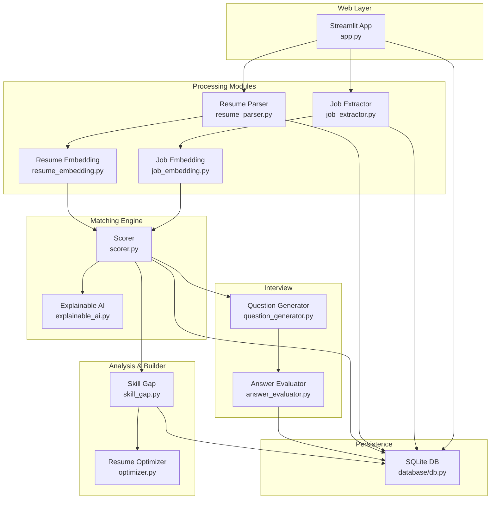

**Diagram sources**
- [app.py](file://app.py#L1-L560)
- [job_module/job_extractor.py](file://job_module/job_extractor.py#L1-L82)
- [job_module/job_embedding.py](file://job_module/job_embedding.py#L1-L37)
- [resume_module/resume_parser.py](file://resume_module/resume_parser.py#L1-L87)
- [resume_module/resume_embedding.py](file://resume_module/resume_embedding.py#L1-L37)
- [match_engine/scorer.py](file://match_engine/scorer.py#L1-L152)
- [match_engine/explainable_ai.py](file://match_engine/explainable_ai.py#L1-L76)
- [gap_module/skill_gap.py](file://gap_module/skill_gap.py#L1-L82)
- [resume_builder/optimizer.py](file://resume_builder/optimizer.py#L1-L91)
- [interview_module/question_generator.py](file://interview_module/question_generator.py#L1-L83)
- [interview_module/answer_evaluator.py](file://interview_module/answer_evaluator.py#L1-L117)
- [database/db.py](file://database/db.py#L1-L252)

**Section sources**
- [app.py](file://app.py#L1-L560)
- [database/db.py](file://database/db.py#L1-L252)

## Core Components
- Streamlit application controller: Manages navigation, session state, and orchestrates module invocations per step
- Configuration: Centralizes API keys, model names, embedding model, scoring weights, and retry policies
- Database layer: Initializes tables, serializes/deserializes embeddings, and persists job, resume, match, gap, and interview data
- Job processing: Structured extraction and semantic embedding of job descriptions
- Resume processing: Text extraction from PDFs and structured parsing with semantic embedding
- Matching engine: Semantic similarity, categorical scoring, weighted aggregation, and explanations
- Gap analysis: Recommendations for courses, projects, and prioritized skills
- Resume builder: Optimization suggestions aligned with job requirements and gap analysis
- Interview module: Adaptive question generation and voice-enabled answer evaluation

**Section sources**
- [app.py](file://app.py#L1-L560)
- [config.py](file://config.py#L1-L23)
- [database/db.py](file://database/db.py#L1-L252)

## Architecture Overview
The system follows a modular pipeline with explicit boundaries:
- Input ingestion: Job text and PDF uploads
- Structured extraction: AI-driven parsing into standardized schemas
- Embedding generation: Local sentence-transformers for semantic vectors
- Matching computation: Cosine similarity and weighted scoring
- Interpretability: Human-readable explanations via AI
- Personalization: Gap analysis and resume optimization
- Interview simulation: Adaptive questions and evaluation with optional voice

External integrations:
- Google Generative AI for structured extraction, explanations, gap analysis, resume optimization, and question generation
- Sentence Transformers for local semantic embeddings
- SQLite for lightweight persistence and embedding storage

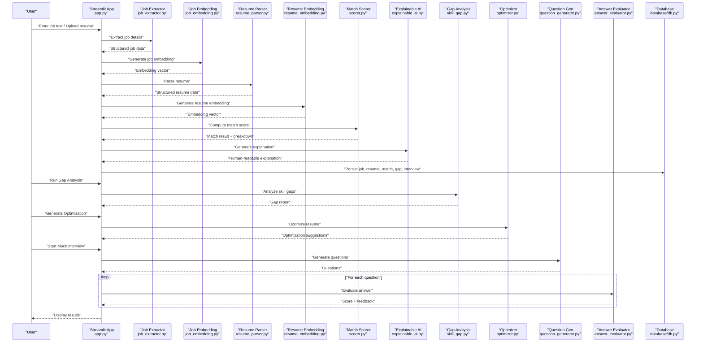

**Diagram sources**
- [app.py](file://app.py#L74-L560)
- [job_module/job_extractor.py](file://job_module/job_extractor.py#L46-L82)
- [job_module/job_embedding.py](file://job_module/job_embedding.py#L16-L37)
- [resume_module/resume_parser.py](file://resume_module/resume_parser.py#L39-L87)
- [resume_module/resume_embedding.py](file://resume_module/resume_embedding.py#L16-L37)
- [match_engine/scorer.py](file://match_engine/scorer.py#L79-L152)
- [match_engine/explainable_ai.py](file://match_engine/explainable_ai.py#L37-L76)
- [gap_module/skill_gap.py](file://gap_module/skill_gap.py#L43-L82)
- [resume_builder/optimizer.py](file://resume_builder/optimizer.py#L48-L91)
- [interview_module/question_generator.py](file://interview_module/question_generator.py#L40-L83)
- [interview_module/answer_evaluator.py](file://interview_module/answer_evaluator.py#L49-L117)
- [database/db.py](file://database/db.py#L92-L239)

## Detailed Component Analysis

### Streamlit Application Controller
- Responsibilities:
  - Navigation and step-based workflow
  - Session state management for intermediate results
  - Orchestration of module invocations per step
  - UI rendering and user prompts
- Patterns:
  - Module pattern: Each step is isolated and imports only required modules
  - Conditional flow: Branches based on session state and completion checks
- Integration:
  - Calls extraction, embedding, matching, analysis, and interview modules
  - Persists results to database and retrieves latest records

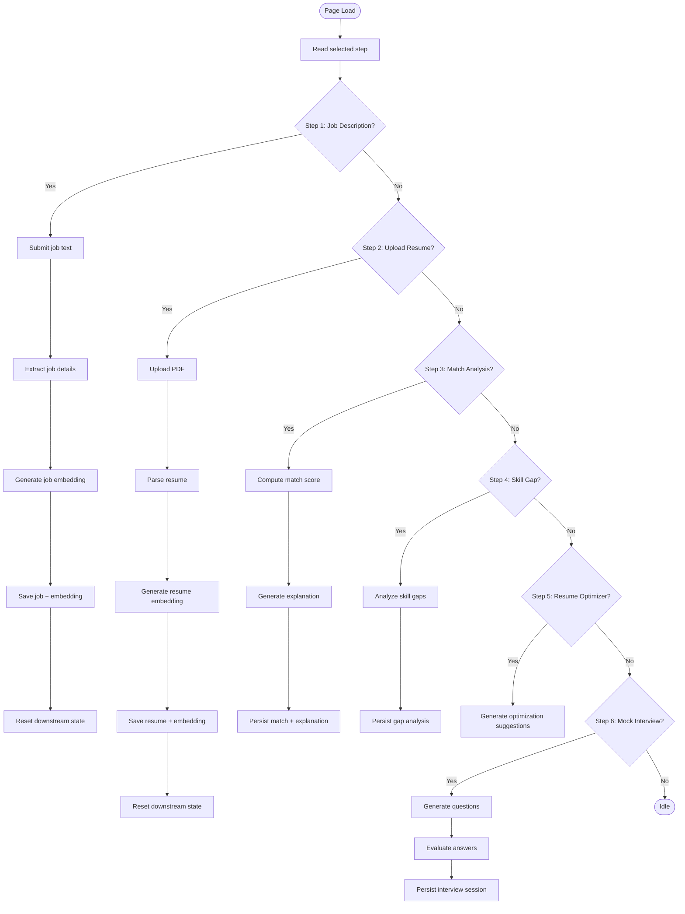

**Diagram sources**
- [app.py](file://app.py#L74-L560)

**Section sources**
- [app.py](file://app.py#L1-L560)

### Database Layer
- Responsibilities:
  - Initialize schema with jobs, resumes, match_results, gap_analyses, interview_sessions
  - Serialize/deserialize NumPy embeddings to/from SQLite BLOB
  - CRUD operations for all entities with JSON serialization for structured data
- Data model highlights:
  - Embeddings stored as binary for efficient similarity computations
  - Foreign keys link match results to jobs and resumes
  - Gap analyses and interview sessions linked to match results

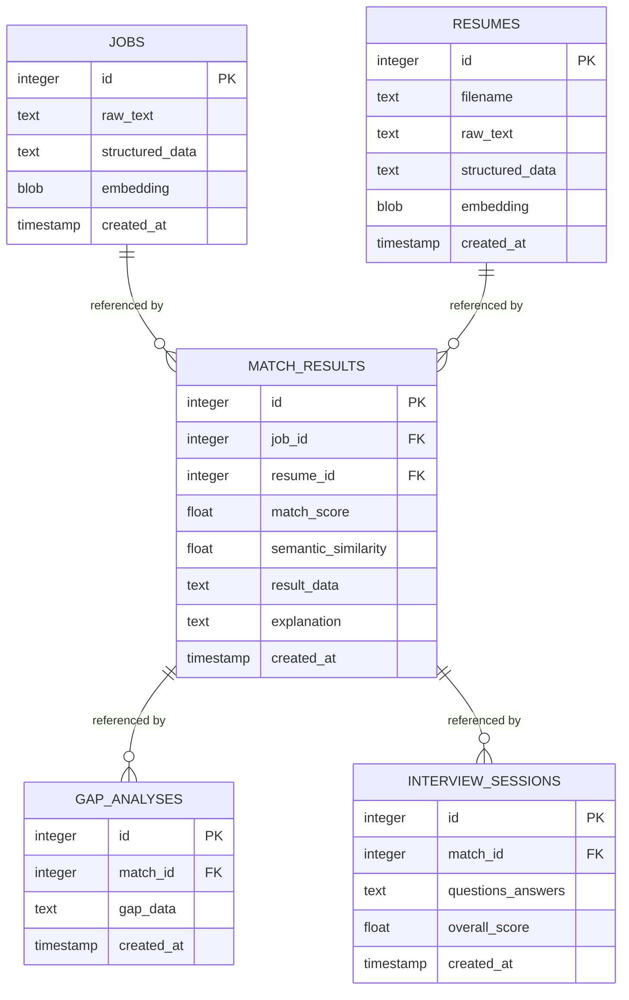

**Diagram sources**
- [database/db.py](file://database/db.py#L19-L74)

**Section sources**
- [database/db.py](file://database/db.py#L1-L252)

### Job Processing Pipeline
- Extraction: Structured job data via AI with normalized fields
- Embedding: Combined structured fields and raw text into a semantic vector
- Persistence: Saves raw text, structured data, and embedding to database

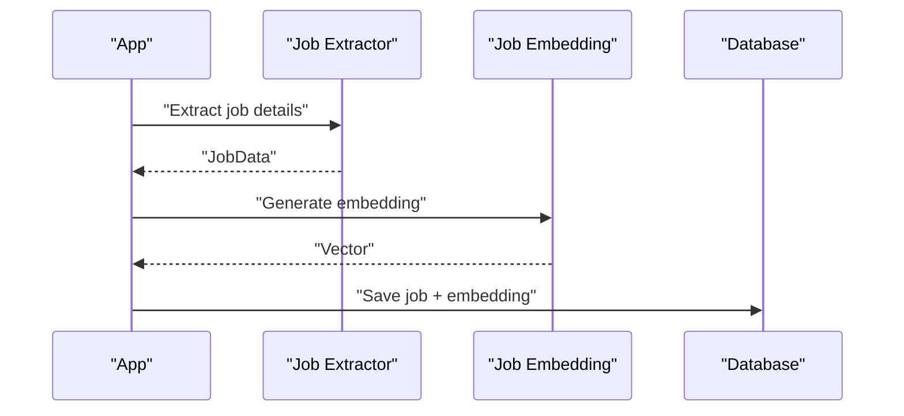

**Diagram sources**
- [job_module/job_extractor.py](file://job_module/job_extractor.py#L46-L82)
- [job_module/job_embedding.py](file://job_module/job_embedding.py#L16-L37)
- [database/db.py](file://database/db.py#L92-L102)

**Section sources**
- [job_module/job_extractor.py](file://job_module/job_extractor.py#L1-L82)
- [job_module/job_embedding.py](file://job_module/job_embedding.py#L1-L37)
- [database/db.py](file://database/db.py#L80-L102)

### Resume Processing Pipeline
- PDF text extraction: Uses library to parse PDF bytes
- Parsing: Structured resume data via AI
- Embedding: Combined structured fields and raw text into a semantic vector
- Persistence: Saves filename, raw text, structured data, and embedding

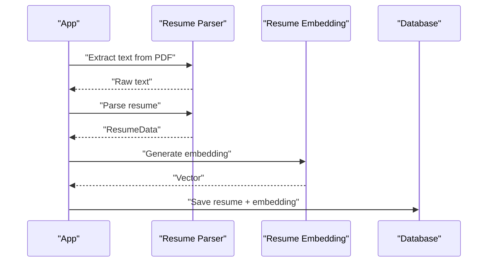

**Diagram sources**
- [resume_module/resume_parser.py](file://resume_module/resume_parser.py#L39-L87)
- [resume_module/resume_embedding.py](file://resume_module/resume_embedding.py#L16-L37)
- [database/db.py](file://database/db.py#L125-L135)

**Section sources**
- [resume_module/resume_parser.py](file://resume_module/resume_parser.py#L1-L87)
- [resume_module/resume_embedding.py](file://resume_module/resume_embedding.py#L1-L37)
- [database/db.py](file://database/db.py#L123-L135)

### Matching Engine
- Inputs: Job and resume embeddings, structured data
- Computation:
  - Semantic similarity via cosine similarity
  - Skill and tools match percentages
  - Heuristic experience and education scores
- Aggregation: Weighted final score using configurable weights
- Output: Comprehensive breakdown and match score

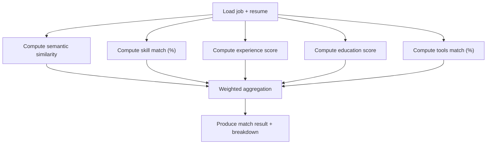

**Diagram sources**
- [match_engine/scorer.py](file://match_engine/scorer.py#L79-L152)

**Section sources**
- [match_engine/scorer.py](file://match_engine/scorer.py#L1-L152)

### Explainable AI
- Purpose: Human-readable explanation of match outcomes
- Inputs: Match score, semantic similarity, matched/missing skills/tools, job and candidate details
- Output: Natural-language explanation for candidate guidance

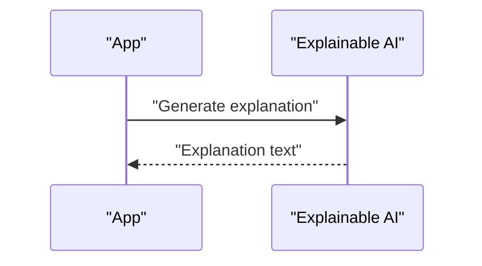

**Diagram sources**
- [match_engine/explainable_ai.py](file://match_engine/explainable_ai.py#L37-L76)

**Section sources**
- [match_engine/explainable_ai.py](file://match_engine/explainable_ai.py#L1-L76)

### Gap Analysis
- Purpose: Identify skill/tool gaps and suggest actionable improvements
- Inputs: Job data, resume data, match result breakdown
- Output: Recommended courses, project suggestions, prioritized skills

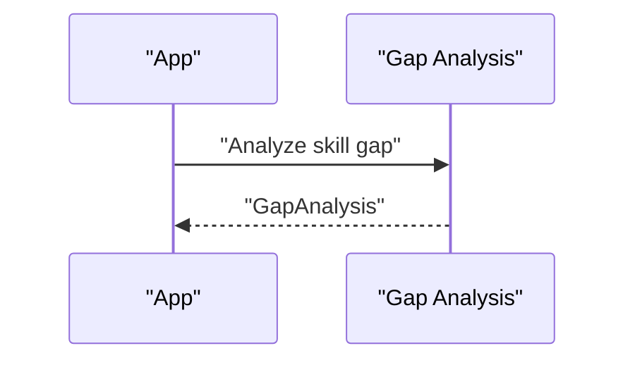

**Diagram sources**
- [gap_module/skill_gap.py](file://gap_module/skill_gap.py#L43-L82)

**Section sources**
- [gap_module/skill_gap.py](file://gap_module/skill_gap.py#L1-L82)

### Resume Builder
- Purpose: Provide optimization suggestions aligned with job requirements and gap analysis
- Inputs: Job data, resume data, gap analysis
- Output: Optimized summary, project bullets, emphasized skills, ATS keywords

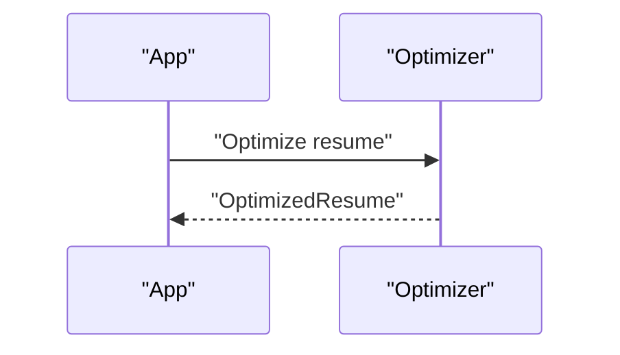

**Diagram sources**
- [resume_builder/optimizer.py](file://resume_builder/optimizer.py#L48-L91)

**Section sources**
- [resume_builder/optimizer.py](file://resume_builder/optimizer.py#L1-L91)

### Interview Module
- Question Generation: Adaptive questions based on job, resume, match score, and missing skills
- Voice-enabled Interaction: Optional TTS/STT for reading questions and capturing answers
- Answer Evaluation: Blended score combining embedding similarity and LLM reasoning

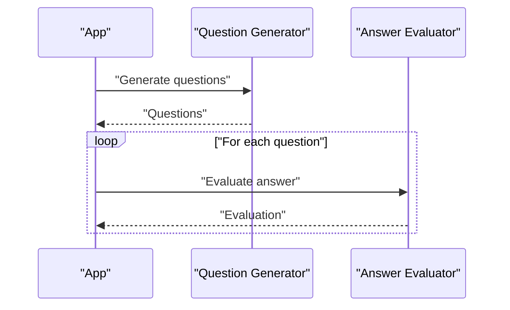

**Diagram sources**
- [interview_module/question_generator.py](file://interview_module/question_generator.py#L40-L83)
- [interview_module/answer_evaluator.py](file://interview_module/answer_evaluator.py#L49-L117)

**Section sources**
- [interview_module/question_generator.py](file://interview_module/question_generator.py#L1-L83)
- [interview_module/answer_evaluator.py](file://interview_module/answer_evaluator.py#L1-L117)

## Dependency Analysis
- External libraries:
  - Streamlit for UI and session state
  - Google Generative AI for structured extraction and reasoning
  - Sentence Transformers and scikit-learn for embeddings and similarity
  - PyMuPDF for PDF text extraction
  - NumPy for numerical operations
  - Python-dotenv for environment configuration
- Internal dependencies:
  - App imports modules from dedicated packages
  - All modules depend on configuration for API keys and model settings
  - Database module centralizes persistence and embedding serialization

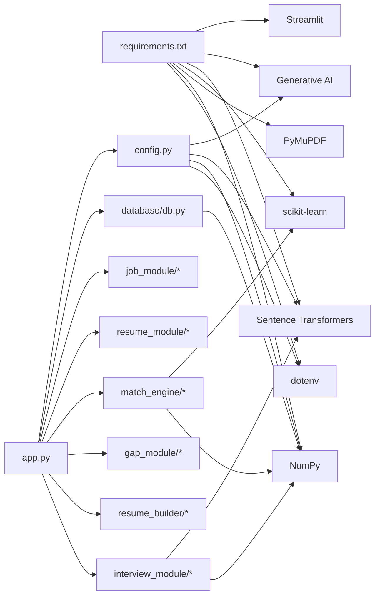

**Diagram sources**
- [requirements.txt](file://requirements.txt#L1-L12)
- [app.py](file://app.py#L1-L21)
- [config.py](file://config.py#L1-L23)
- [database/db.py](file://database/db.py#L1-L252)

**Section sources**
- [requirements.txt](file://requirements.txt#L1-L12)
- [app.py](file://app.py#L1-L21)
- [config.py](file://config.py#L1-L23)
- [database/db.py](file://database/db.py#L1-L252)

## Performance Considerations
- Embedding caching: Embedding models are lazily initialized and reused globally to avoid repeated loading overhead
- Local embeddings: Using sentence-transformers locally reduces latency compared to remote APIs for embeddings
- SQLite BLOB storage: Efficiently stores dense vectors; ensure appropriate indexing if scaling to large datasets
- Retry and backoff: Configurable retries and delays mitigate transient API errors
- Streaming UI: Use of spinner messages improves perceived responsiveness during long-running operations

[No sources needed since this section provides general guidance]

## Troubleshooting Guide
- API quota limits:
  - Gemini API may return quota exhaustion errors; the system surfaces actionable messages and suggests enabling billing or waiting for reset
- PDF parsing:
  - Ensure PDFs are scannable or contain selectable text; fallbacks for empty bytes are handled
- Session state resets:
  - Completing upstream steps clears downstream state to prevent stale results
- Voice features:
  - Microphone availability affects voice-enabled interview features; fallback to text input is supported

**Section sources**
- [job_module/job_extractor.py](file://job_module/job_extractor.py#L63-L74)
- [resume_module/resume_parser.py](file://resume_module/resume_parser.py#L67-L78)
- [match_engine/explainable_ai.py](file://match_engine/explainable_ai.py#L66-L71)
- [gap_module/skill_gap.py](file://gap_module/skill_gap.py#L70-L77)
- [resume_builder/optimizer.py](file://resume_builder/optimizer.py#L78-L86)
- [interview_module/question_generator.py](file://interview_module/question_generator.py#L71-L78)
- [interview_module/answer_evaluator.py](file://interview_module/answer_evaluator.py#L94-L105)

## Conclusion
The Job Matching Platform employs a clean, modular architecture that separates concerns across job and resume processing, semantic matching, gap analysis, resume optimization, and interview simulation. The Streamlit controller orchestrates a linear workflow with robust persistence and explainability. Integrations with external AI services are encapsulated within focused modules, while local embedding and SQLite provide efficient, reproducible processing. This design supports incremental feature additions, improved reliability through retries, and a scalable foundation for future enhancements.
