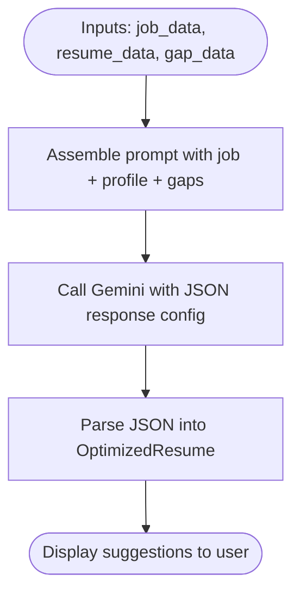

# Key Features

<cite>
**Referenced Files in This Document**
- [app.py](file://app.py)
- [config.py](file://config.py)
- [requirements.txt](file://requirements.txt)
- [database/db.py](file://database/db.py)
- [job_module/job_extractor.py](file://job_module/job_extractor.py)
- [job_module/job_embedding.py](file://job_module/job_embedding.py)
- [resume_module/resume_parser.py](file://resume_module/resume_parser.py)
- [resume_module/resume_embedding.py](file://resume_module/resume_embedding.py)
- [match_engine/scorer.py](file://match_engine/scorer.py)
- [match_engine/explainable_ai.py](file://match_engine/explainable_ai.py)
- [gap_module/skill_gap.py](file://gap_module/skill_gap.py)
- [resume_builder/optimizer.py](file://resume_builder/optimizer.py)
- [interview_module/question_generator.py](file://interview_module/question_generator.py)
- [interview_module/answer_evaluator.py](file://interview_module/answer_evaluator.py)
</cite>

## Table of Contents
1. [Introduction](#introduction)
2. [Project Structure](#project-structure)
3. [Core Components](#core-components)
4. [Architecture Overview](#architecture-overview)
5. [Detailed Component Analysis](#detailed-component-analysis)
6. [Dependency Analysis](#dependency-analysis)
7. [Performance Considerations](#performance-considerations)
8. [Troubleshooting Guide](#troubleshooting-guide)
9. [Conclusion](#conclusion)
10. [Appendices](#appendices)

## Introduction
This document explains the Job Matching Platform’s key features and capabilities. It focuses on:
- AI-powered job description analysis with structured extraction and semantic embeddings
- Resume parsing with PDF text extraction, AI-powered structuring, and semantic embeddings
- An intelligent matching engine with weighted scoring, similarity metrics, and human-readable explanations
- Skill gap analysis for identifying missing requirements and generating personalized learning recommendations
- Resume optimization with ATS keyword integration, content enhancements, and formatting guidance
- A mock interview system with adaptive question generation, optional voice processing, and answer evaluation

The platform integrates Streamlit for the UI, Google Generative AI for structured extraction and reasoning, SentenceTransformers for semantic embeddings, and scikit-learn for similarity computation. All results are persisted in a SQLite database.

## Project Structure
The application is organized into feature-focused modules with clear separation of concerns:
- UI and orchestration: app.py
- Configuration: config.py
- Database schema and persistence: database/db.py
- Job processing: job_module/job_extractor.py, job_module/job_embedding.py
- Resume processing: resume_module/resume_parser.py, resume_module/resume_embedding.py
- Matching and explanations: match_engine/scorer.py, match_engine/explainable_ai.py
- Gap analysis and resume optimization: gap_module/skill_gap.py, resume_builder/optimizer.py
- Interview system: interview_module/question_generator.py, interview_module/answer_evaluator.py

**Diagram sources**
- [app.py](file://app.py#L1-L560)
- [config.py](file://config.py#L1-L23)
- [database/db.py](file://database/db.py#L1-L252)
- [job_module/job_extractor.py](file://job_module/job_extractor.py#L1-L82)
- [job_module/job_embedding.py](file://job_module/job_embedding.py#L1-L37)
- [resume_module/resume_parser.py](file://resume_module/resume_parser.py#L1-L87)
- [resume_module/resume_embedding.py](file://resume_module/resume_embedding.py#L1-L37)
- [match_engine/scorer.py](file://match_engine/scorer.py#L1-L152)
- [match_engine/explainable_ai.py](file://match_engine/explainable_ai.py#L1-L76)
- [gap_module/skill_gap.py](file://gap_module/skill_gap.py#L1-L82)
- [resume_builder/optimizer.py](file://resume_builder/optimizer.py#L1-L91)
- [interview_module/question_generator.py](file://interview_module/question_generator.py#L1-L83)
- [interview_module/answer_evaluator.py](file://interview_module/answer_evaluator.py#L1-L117)

**Section sources**
- [app.py](file://app.py#L1-L560)
- [config.py](file://config.py#L1-L23)
- [database/db.py](file://database/db.py#L1-L252)

## Core Components
- AI-powered job description analysis
  - Structured extraction via Gemini with a strict JSON schema
  - Semantic embedding generation combining structured fields and raw text
- Resume parsing
  - PDF text extraction using PyMuPDF
  - AI-powered structuring with a strict JSON schema
  - Semantic embedding generation combining structured fields and raw text
- Intelligent matching engine
  - Cosine similarity between embeddings
  - Skill and tools match percentages
  - Heuristic experience and education match scores
  - Weighted composite score with configurable weights
  - Human-readable explanation generated by Gemini
- Skill gap analysis
  - Identifies missing skills and tools
  - Recommends courses, projects, and prioritized skills
- Resume optimization
  - Generates a tailored professional summary
  - Suggests project bullet points and emphasized skills
  - Adds ATS-aligned keywords derived from the job description
- Mock interview system
  - Adaptive question generation considering match score and missing skills
  - Optional voice support for reading questions aloud and capturing answers
  - Answer evaluation blending embedding similarity and LLM reasoning

**Section sources**
- [job_module/job_extractor.py](file://job_module/job_extractor.py#L1-L82)
- [job_module/job_embedding.py](file://job_module/job_embedding.py#L1-L37)
- [resume_module/resume_parser.py](file://resume_module/resume_parser.py#L1-L87)
- [resume_module/resume_embedding.py](file://resume_module/resume_embedding.py#L1-L37)
- [match_engine/scorer.py](file://match_engine/scorer.py#L1-L152)
- [match_engine/explainable_ai.py](file://match_engine/explainable_ai.py#L1-L76)
- [gap_module/skill_gap.py](file://gap_module/skill_gap.py#L1-L82)
- [resume_builder/optimizer.py](file://resume_builder/optimizer.py#L1-L91)
- [interview_module/question_generator.py](file://interview_module/question_generator.py#L1-L83)
- [interview_module/answer_evaluator.py](file://interview_module/answer_evaluator.py#L1-L117)

## Architecture Overview
The platform follows a pipeline-driven architecture:
- Users input a job description and upload a resume
- Both are processed through AI extraction and semantic embedding
- A matching engine computes a weighted score and generates explanations
- Gap analysis and resume optimization suggest improvements
- The mock interview system adapts questions and evaluates answers

**Diagram sources**
- [app.py](file://app.py#L74-L560)
- [job_module/job_extractor.py](file://job_module/job_extractor.py#L46-L82)
- [job_module/job_embedding.py](file://job_module/job_embedding.py#L16-L37)
- [resume_module/resume_parser.py](file://resume_module/resume_parser.py#L39-L87)
- [resume_module/resume_embedding.py](file://resume_module/resume_embedding.py#L16-L37)
- [match_engine/scorer.py](file://match_engine/scorer.py#L79-L152)
- [match_engine/explainable_ai.py](file://match_engine/explainable_ai.py#L37-L76)
- [gap_module/skill_gap.py](file://gap_module/skill_gap.py#L43-L82)
- [resume_builder/optimizer.py](file://resume_builder/optimizer.py#L48-L91)
- [interview_module/question_generator.py](file://interview_module/question_generator.py#L40-L83)
- [interview_module/answer_evaluator.py](file://interview_module/answer_evaluator.py#L49-L117)
- [database/db.py](file://database/db.py#L92-L239)

## Detailed Component Analysis

### AI-Powered Job Description Analysis
- Structured extraction
  - Uses a fixed JSON schema to normalize job details (title, company, location, experience, skills, tools, soft skills, job type, salary)
  - Applies retries with exponential backoff for robustness
- Semantic embedding
  - Combines normalized structured fields and a snippet of raw text for rich semantic representation
  - Uses a sentence-transformers model configured via environment settings

**Diagram sources**
- [job_module/job_extractor.py](file://job_module/job_extractor.py#L46-L82)
- [job_module/job_embedding.py](file://job_module/job_embedding.py#L16-L37)
- [database/db.py](file://database/db.py#L92-L102)

**Section sources**
- [job_module/job_extractor.py](file://job_module/job_extractor.py#L1-L82)
- [job_module/job_embedding.py](file://job_module/job_embedding.py#L1-L37)
- [config.py](file://config.py#L6-L8)
- [database/db.py](file://database/db.py#L92-L102)

### Resume Parsing and Semantic Analysis
- PDF text extraction
  - Reads all pages using PyMuPDF and concatenates text
- AI-powered structuring
  - Enforces a strict JSON schema for skills, projects, experience, education, certifications, and tools
  - Normalizes entries to lowercase
- Semantic embedding
  - Builds a combined text from structured fields and a raw-text snippet
  - Encodes with the same sentence-transformers model

**Diagram sources**
- [resume_module/resume_parser.py](file://resume_module/resume_parser.py#L39-L87)
- [resume_module/resume_embedding.py](file://resume_module/resume_embedding.py#L16-L37)
- [database/db.py](file://database/db.py#L125-L135)

**Section sources**
- [resume_module/resume_parser.py](file://resume_module/resume_parser.py#L1-L87)
- [resume_module/resume_embedding.py](file://resume_module/resume_embedding.py#L1-L37)
- [config.py](file://config.py#L6-L8)
- [database/db.py](file://database/db.py#L125-L135)

### Intelligent Matching Engine
- Inputs
  - Job and resume embeddings (cosine similarity)
  - Skill and tools match percentages
  - Experience and education heuristic scores
- Scoring
  - Weighted linear combination with configurable weights
  - Final score clamped to 0–100
- Outputs
  - Match score, semantic similarity, and per-category breakdown
  - Detailed lists of matched and missing skills/tools
- Explanations
  - Human-readable narrative generated by Gemini summarizing strengths and gaps

**Diagram sources**
- [match_engine/scorer.py](file://match_engine/scorer.py#L79-L152)
- [match_engine/explainable_ai.py](file://match_engine/explainable_ai.py#L37-L76)
- [database/db.py](file://database/db.py#L158-L169)

**Section sources**
- [match_engine/scorer.py](file://match_engine/scorer.py#L1-L152)
- [match_engine/explainable_ai.py](file://match_engine/explainable_ai.py#L1-L76)
- [config.py](file://config.py#L12-L18)
- [database/db.py](file://database/db.py#L158-L169)

### Skill Gap Analysis
- Purpose
  - Identify missing skills and tools from the match result
  - Recommend courses, projects, and prioritized skills to bridge gaps
- Method
  - Prompts Gemini to return a structured response with actionable items
  - Integrates job requirements and candidate profile

**Diagram sources**
- [gap_module/skill_gap.py](file://gap_module/skill_gap.py#L43-L82)
- [database/db.py](file://database/db.py#L192-L201)

**Section sources**
- [gap_module/skill_gap.py](file://gap_module/skill_gap.py#L1-L82)
- [database/db.py](file://database/db.py#L192-L201)

### Resume Optimization
- Purpose
  - Provide tailored suggestions to align the resume with the target job
- Outputs
  - Optimized professional summary
  - Suggested project bullet points
  - Skills to emphasize
  - ATS keywords to add
- Method
  - Uses Gemini with a structured prompt incorporating job details, candidate profile, and gap analysis

**Diagram sources**
- [resume_builder/optimizer.py](file://resume_builder/optimizer.py#L48-L91)

**Section sources**
- [resume_builder/optimizer.py](file://resume_builder/optimizer.py#L1-L91)

### Mock Interview System
- Adaptive question generation
  - Considers job requirements, candidate profile, match score, and missing skills
  - Produces a balanced mix of question categories and difficulty progression
- Voice processing
  - Optional TTS to read questions aloud
  - Optional STT to capture spoken answers (requires microphone availability)
- Answer evaluation
  - Embedding similarity between expected topics and candidate answer
  - LLM-based evaluation for score, technical depth, clarity, and feedback
  - Blended score combining embedding similarity and LLM judgment

**Diagram sources**
- [app.py](file://app.py#L424-L560)
- [interview_module/question_generator.py](file://interview_module/question_generator.py#L40-L83)
- [interview_module/answer_evaluator.py](file://interview_module/answer_evaluator.py#L49-L117)

**Section sources**
- [interview_module/question_generator.py](file://interview_module/question_generator.py#L1-L83)
- [interview_module/answer_evaluator.py](file://interview_module/answer_evaluator.py#L1-L117)
- [app.py](file://app.py#L424-L560)

## Dependency Analysis
External libraries and their roles:
- Streamlit: UI framework for step-by-step workflows
- google-generativeai: Structured extraction and reasoning for job, resume, explanations, gap analysis, optimizer, and interview prompts
- sentence-transformers: Semantic embeddings for jobs and resumes
- PyMuPDF: PDF text extraction
- pydantic: Data modeling and validation
- python-dotenv: Environment configuration loading
- pyttsx3, SpeechRecognition, PyAudio: Optional voice capabilities
- numpy, scikit-learn: Numerical computing and cosine similarity

**Diagram sources**
- [requirements.txt](file://requirements.txt#L1-L12)

**Section sources**
- [requirements.txt](file://requirements.txt#L1-L12)

## Performance Considerations
- Embedding model initialization
  - Models are lazily initialized and reused to avoid repeated cold starts
- Retries and backoff
  - All external API calls use retry loops with incremental delays to handle transient failures
- Database serialization
  - Embeddings are serialized as float32 byte arrays for compact storage and fast retrieval
- Computation order
  - Matching aggregates multiple metrics; keep prompt sizes reasonable to minimize latency
- UI responsiveness
  - Long-running tasks are wrapped in spinner widgets to maintain user feedback

[No sources needed since this section provides general guidance]

## Troubleshooting Guide
- Gemini API quota exceeded
  - Symptom: Errors mentioning resource exhaustion or rate limits
  - Action: Wait for quota to reset or enable billing; the code surfaces clear messages
- PDF parsing issues
  - Symptom: Empty or garbled text extraction
  - Action: Verify PDF integrity and ensure text is selectable
- Missing microphone or audio devices
  - Symptom: Voice features unavailable or errors during recording
  - Action: Install system audio drivers and ensure permissions; fallback to text input is supported
- Database connectivity
  - Symptom: Failures saving or retrieving records
  - Action: Confirm database path and file permissions; ensure foreign keys are respected

**Section sources**
- [job_module/job_extractor.py](file://job_module/job_extractor.py#L63-L74)
- [resume_module/resume_parser.py](file://resume_module/resume_parser.py#L67-L78)
- [match_engine/explainable_ai.py](file://match_engine/explainable_ai.py#L66-L71)
- [gap_module/skill_gap.py](file://gap_module/skill_gap.py#L70-L77)
- [resume_builder/optimizer.py](file://resume_builder/optimizer.py#L78-L86)
- [interview_module/question_generator.py](file://interview_module/question_generator.py#L71-L78)
- [interview_module/answer_evaluator.py](file://interview_module/answer_evaluator.py#L94-L116)
- [database/db.py](file://database/db.py#L82-L87)

## Conclusion
The Job Matching Platform delivers a complete job search optimization solution by combining structured AI extraction, semantic embeddings, weighted matching, and human-centric insights. It empowers candidates to understand fit, identify skill gaps, enhance their resumes, and practice interviews—guided by adaptive, explainable AI.

[No sources needed since this section summarizes without analyzing specific files]

## Appendices

### Practical Examples
- Job Description Analysis
  - Paste a job description; the system extracts structured fields and generates a semantic embedding, then persists the record for future matching
- Resume Parsing
  - Upload a PDF; the system extracts text, structures the content, generates an embedding, and persists the record
- Match Analysis
  - Run the matching engine to compute a weighted score, view per-category metrics, and read a human-readable explanation
- Skill Gap Analysis
  - Based on the match result, receive recommendations for courses, projects, and prioritized skills to learn
- Resume Optimization
  - Receive suggestions for a tailored summary, project bullet points, emphasized skills, and ATS keywords aligned with the job
- Mock Interview
  - Generate adaptive interview questions, optionally use voice to read questions and record answers, and receive blended evaluations with feedback

[No sources needed since this section provides general guidance]
