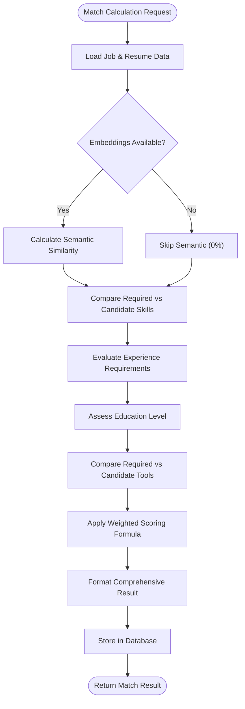

# Project Overview

<cite>
**Referenced Files in This Document**
- [app.py](file://app.py)
- [config.py](file://config.py)
- [requirements.txt](file://requirements.txt)
- [database/db.py](file://database/db.py)
- [job_module/job_extractor.py](file://job_module/job_extractor.py)
- [job_module/job_embedding.py](file://job_module/job_embedding.py)
- [resume_module/resume_parser.py](file://resume_module/resume_parser.py)
- [resume_module/resume_embedding.py](file://resume_module/resume_embedding.py)
- [match_engine/scorer.py](file://match_engine/scorer.py)
- [match_engine/explainable_ai.py](file://match_engine/explainable_ai.py)
- [gap_module/skill_gap.py](file://gap_module/skill_gap.py)
- [resume_builder/optimizer.py](file://resume_builder/optimizer.py)
- [interview_module/question_generator.py](file://interview_module/question_generator.py)
- [interview_module/answer_evaluator.py](file://interview_module/answer_evaluator.py)
- [interview_module/voice_engine.py](file://interview_module/voice_engine.py)
</cite>

## Table of Contents
1. [Introduction](#introduction)
2. [Project Structure](#project-structure)
3. [Core Components](#core-components)
4. [Architecture Overview](#architecture-overview)
5. [Detailed Component Analysis](#detailed-component-analysis)
6. [Dependency Analysis](#dependency-analysis)
7. [Performance Considerations](#performance-considerations)
8. [Troubleshooting Guide](#troubleshooting-guide)
9. [Conclusion](#conclusion)

## Introduction
The Job Matching Platform is an AI-powered job search optimization tool designed to transform the traditional job application process through automation and intelligent insights. It combines natural language processing with a web-based user interface built on Streamlit to deliver a seamless, end-to-end experience for job seekers and career professionals.

The platform automates key stages of job application preparation:
- Job description analysis and structuring
- Resume parsing and semantic understanding
- Intelligent matching with scoring and explanations
- Skill gap identification with actionable recommendations
- Resume optimization tailored to target roles
- Adaptive mock interview preparation with voice-enabled interaction

By integrating Google Gemini for natural language understanding and Sentence Transformers for semantic embeddings, the platform provides accurate, data-driven insights that help candidates tailor their applications and prepare effectively for interviews.

## Project Structure
The project follows a modular, feature-based architecture organized into distinct functional areas:

**Diagram sources**
- [app.py](file://app.py#L1-L560)
- [config.py](file://config.py#L1-L23)
- [database/db.py](file://database/db.py#L1-L252)

**Section sources**
- [app.py](file://app.py#L1-L560)
- [config.py](file://config.py#L1-L23)

## Core Components
The platform consists of six primary modules, each responsible for a specific aspect of the job matching pipeline:

### Web Interface (Streamlit)
The central user interface provides a guided workflow through six steps:
- Job Description Extraction
- Resume Upload and Parsing
- Match Analysis and Scoring
- Skill Gap Analysis
- Resume Optimization
- Mock Interview Preparation

### Data Processing Pipeline
The pipeline transforms unstructured job descriptions and resumes into structured, machine-readable formats suitable for matching and analysis.

### Matching Engine
Computes similarity scores between job requirements and candidate profiles using multiple criteria including semantic similarity, skills, experience, education, and tools.

### Skill Gap Analysis
Identifies missing competencies and provides targeted recommendations for courses, projects, and skills to develop.

### Resume Optimization
Generates actionable suggestions to enhance resume content and improve ATS compatibility.

### Interview Preparation
Creates adaptive mock interview questions and evaluates candidate responses with automated scoring.

**Section sources**
- [app.py](file://app.py#L74-L132)
- [app.py](file://app.py#L137-L203)
- [app.py](file://app.py#L208-L308)
- [app.py](file://app.py#L314-L372)
- [app.py](file://app.py#L378-L420)
- [app.py](file://app.py#L425-L560)

## Architecture Overview
The platform implements a modular pipeline design with clear separation of concerns:

**Diagram sources**
- [app.py](file://app.py#L74-L132)
- [app.py](file://app.py#L137-L203)
- [app.py](file://app.py#L208-L308)
- [app.py](file://app.py#L314-L372)
- [app.py](file://app.py#L378-L420)
- [app.py](file://app.py#L425-L560)

The architecture ensures:
- **Separation of Concerns**: Each module handles a specific processing stage
- **Data Persistence**: All processed data is stored in a structured SQLite database
- **API Integration**: External services (Google Gemini, Sentence Transformers) are encapsulated
- **Scalability**: Modular design allows independent development and testing

## Detailed Component Analysis

### Job Processing Module
Handles job description extraction, structuring, and embedding generation:

**Diagram sources**
- [job_module/job_extractor.py](file://job_module/job_extractor.py#L12-L23)
- [job_module/job_extractor.py](file://job_module/job_extractor.py#L46-L82)
- [job_module/job_embedding.py](file://job_module/job_embedding.py#L16-L37)

Key features:
- Structured extraction of job requirements using Google Gemini
- Semantic embedding generation combining structured fields with raw text
- Normalized skill/tool names for consistent matching
- Retry logic for API rate limiting

**Section sources**
- [job_module/job_extractor.py](file://job_module/job_extractor.py#L1-L82)
- [job_module/job_embedding.py](file://job_module/job_embedding.py#L1-L37)

### Resume Processing Module
Manages resume parsing, text extraction, and semantic representation:

**Diagram sources**
- [resume_module/resume_parser.py](file://resume_module/resume_parser.py#L13-L20)
- [resume_module/resume_parser.py](file://resume_module/resume_parser.py#L39-L87)
- [resume_module/resume_embedding.py](file://resume_module/resume_embedding.py#L16-L37)

Processing capabilities:
- PDF text extraction using PyMuPDF
- Structured resume parsing with Gemini
- Comprehensive skill and project extraction
- Multi-modal embedding construction

**Section sources**
- [resume_module/resume_parser.py](file://resume_module/resume_parser.py#L1-L87)
- [resume_module/resume_embedding.py](file://resume_module/resume_embedding.py#L1-L37)

### Matching Engine
Computes comprehensive match scores using weighted criteria:

**Diagram sources**
- [match_engine/scorer.py](file://match_engine/scorer.py#L79-L152)

Scoring methodology:
- **Semantic Similarity**: 40% weight using cosine similarity between embeddings
- **Skills Match**: 30% weight based on percentage of required skills present
- **Experience**: 15% weight using heuristic experience ratio calculation
- **Education**: 10% weight based on educational level comparison
- **Tools**: 5% weight for required tool proficiency

**Section sources**
- [match_engine/scorer.py](file://match_engine/scorer.py#L1-L152)
- [config.py](file://config.py#L12-L18)

### Skill Gap Analysis
Provides actionable recommendations for competency development:

**Diagram sources**
- [gap_module/skill_gap.py](file://gap_module/skill_gap.py#L43-L82)

Recommendation categories:
- **Recommended Courses**: Platform-specific training programs
- **Project Suggestions**: Hands-on development opportunities
- **Skills to Add**: Prioritized competency development list

**Section sources**
- [gap_module/skill_gap.py](file://gap_module/skill_gap.py#L1-L82)

### Resume Optimization
Generates targeted improvements for ATS compatibility and human readability:

**Diagram sources**
- [resume_builder/optimizer.py](file://resume_builder/optimizer.py#L11-L16)
- [resume_builder/optimizer.py](file://resume_builder/optimizer.py#L48-L91)

Optimization focus areas:
- Professional summary refinement
- Project bullet point enhancement
- Skill emphasis strategies
- ATS keyword integration

**Section sources**
- [resume_builder/optimizer.py](file://resume_builder/optimizer.py#L1-L91)

### Interview Preparation Module
Delivers adaptive mock interview experience with voice capabilities:

**Diagram sources**
- [interview_module/question_generator.py](file://interview_module/question_generator.py#L40-L83)
- [interview_module/answer_evaluator.py](file://interview_module/answer_evaluator.py#L49-L117)
- [interview_module/voice_engine.py](file://interview_module/voice_engine.py#L17-L61)

Interview features:
- **Adaptive Question Generation**: Mix of technical, behavioral, and scenario-based questions
- **Voice Integration**: Text-to-speech and speech-to-text capabilities
- **Multi-Criteria Evaluation**: Technical depth, clarity, and overall quality assessment
- **Blended Scoring**: Combination of LLM evaluation and embedding similarity

**Section sources**
- [interview_module/question_generator.py](file://interview_module/question_generator.py#L1-L83)
- [interview_module/answer_evaluator.py](file://interview_module/answer_evaluator.py#L1-L117)
- [interview_module/voice_engine.py](file://interview_module/voice_engine.py#L1-L61)

## Dependency Analysis
The platform leverages a carefully selected set of dependencies that support its AI-powered functionality:

**Diagram sources**
- [requirements.txt](file://requirements.txt#L1-L12)
- [config.py](file://config.py#L1-L23)

Key dependency roles:
- **Streamlit**: Web framework for interactive user interface
- **Google Generative AI**: Natural language processing and structured extraction
- **Sentence Transformers**: Semantic embeddings for similarity calculations
- **SQLite**: Local database storage for all processed data
- **PyMuPDF**: PDF text extraction capabilities
- **Pydantic**: Data validation and serialization
- **NumPy/SciKit-learn**: Numerical computing and machine learning utilities

**Section sources**
- [requirements.txt](file://requirements.txt#L1-L12)
- [config.py](file://config.py#L1-L23)

## Performance Considerations
The platform is designed with several performance optimization strategies:

### Caching and Model Management
- **Lazy Model Loading**: Sentence Transformer models are loaded once and reused
- **Global Model Instances**: Prevents repeated initialization overhead
- **Embedding Reuse**: Generated embeddings are persisted for future use

### API Efficiency
- **Retry Logic**: Configurable retry attempts with exponential backoff
- **Rate Limit Handling**: Graceful degradation when API quotas are exceeded
- **Batch Processing**: Minimizes API calls through consolidated operations

### Memory Management
- **Streaming Processing**: Large documents are processed incrementally
- **Efficient Data Structures**: NumPy arrays for numerical computations
- **Database Serialization**: Optimized storage of embeddings and structured data

### Scalability Factors
- **Modular Design**: Independent scaling of processing modules
- **Local Storage**: Reduces external dependency bottlenecks
- **Caching Layers**: Reusable intermediate results

## Troubleshooting Guide

### Common Issues and Solutions

#### API Rate Limiting
**Problem**: Google Gemini API quota exceeded errors
**Solution**: 
- Wait for quota reset period (typically daily)
- Enable billing for higher limits
- Reduce concurrent API usage
- Implement proper retry logic with backoff

#### Audio Feature Issues
**Problem**: Microphone not detected or voice features unavailable
**Solution**:
- Verify microphone hardware connectivity
- Check system audio permissions
- Install required system dependencies (PortAudio)
- Test microphone separately using system tools

#### Performance Issues
**Problem**: Slow processing times with large documents
**Solution**:
- Optimize document size before upload
- Use text-only versions when possible
- Monitor system memory usage
- Consider cloud deployment for heavy workloads

#### Database Corruption
**Problem**: SQLite database connection errors
**Solution**:
- Verify database file permissions
- Check disk space availability
- Restart application to release connections
- Backup and restore corrupted databases

**Section sources**
- [job_module/job_extractor.py](file://job_module/job_extractor.py#L63-L75)
- [resume_module/resume_parser.py](file://resume_module/resume_parser.py#L67-L78)
- [interview_module/answer_evaluator.py](file://interview_module/answer_evaluator.py#L94-L117)
- [interview_module/voice_engine.py](file://interview_module/voice_engine.py#L54-L61)

## Conclusion
The Job Matching Platform represents a comprehensive solution for modern job seekers, combining cutting-edge AI technologies with practical career guidance. Through its modular architecture and automated processing pipeline, the platform transforms the traditional job application process by providing:

- **Intelligent Automation**: Streamlined job description and resume processing
- **Data-Driven Insights**: Comprehensive matching with detailed explanations
- **Personalized Development**: Targeted skill gap identification and recommendations
- **Preparation Enhancement**: Adaptive mock interview with voice capabilities
- **Accessibility**: Web-based interface requiring minimal technical expertise

The platform's strength lies in its seamless integration of multiple AI technologies—natural language processing for understanding, semantic embeddings for similarity, and machine learning for scoring—combined with a user-friendly Streamlit interface. This approach enables job seekers to make more informed decisions, present stronger applications, and prepare more effectively for interviews.

Future enhancements could include distributed processing for improved scalability, advanced recommendation systems, and integration with external job boards and professional networks. The modular design ensures that such extensions can be incorporated without disrupting the existing functionality.
