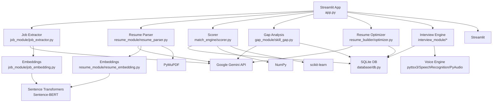
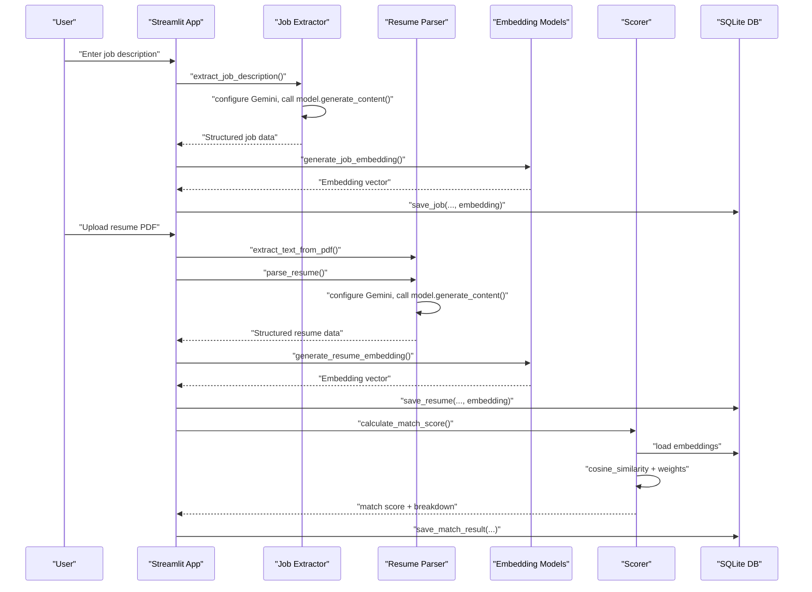
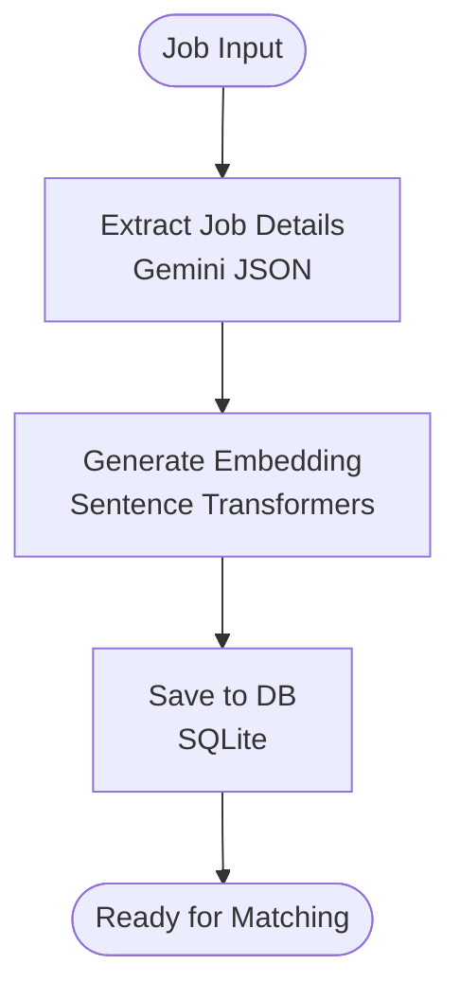
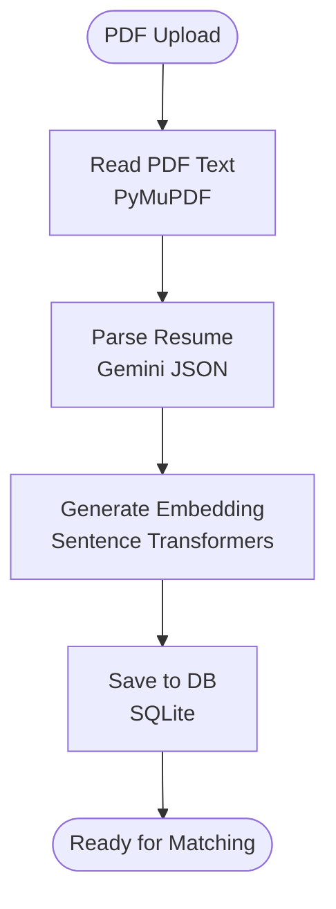
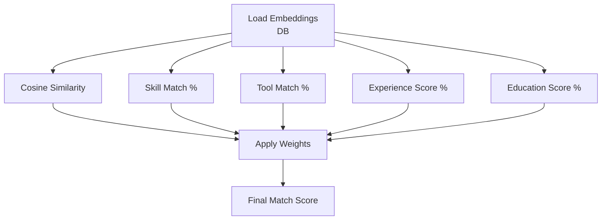
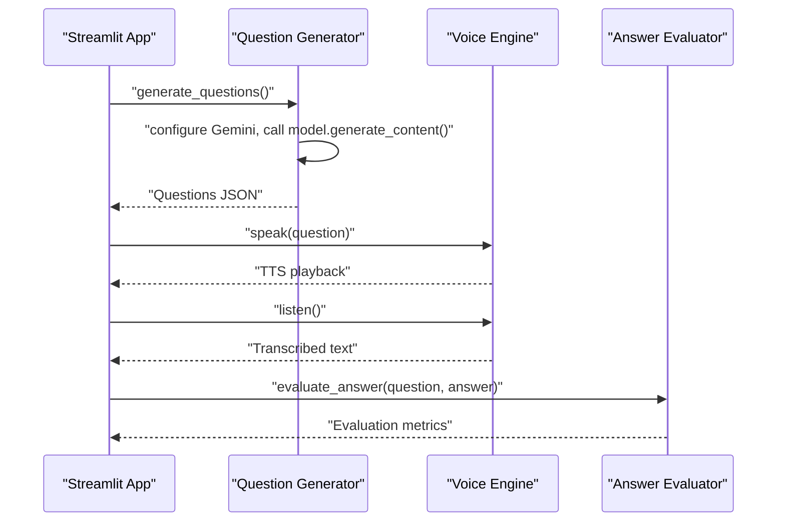
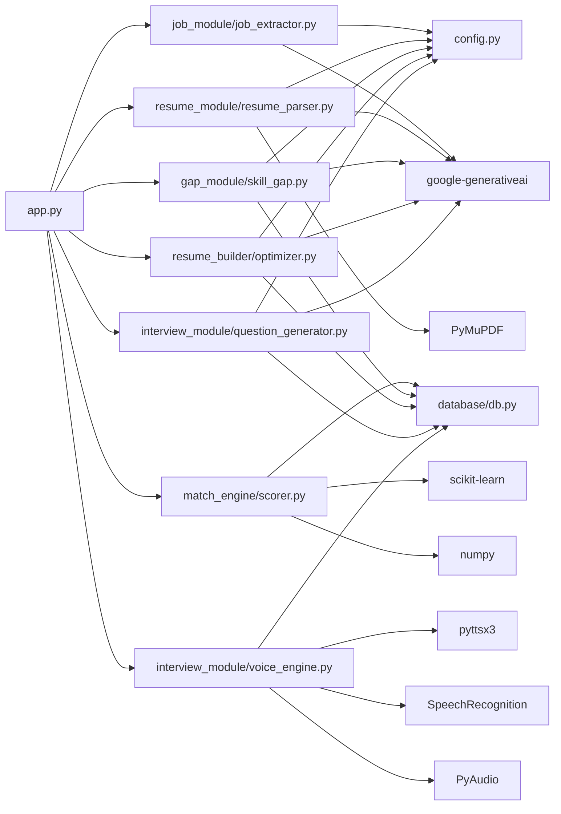

# Technology Stack

<cite>
**Referenced Files in This Document**
- [requirements.txt](file://requirements.txt)
- [app.py](file://app.py)
- [config.py](file://config.py)
- [job_module/job_extractor.py](file://job_module/job_extractor.py)
- [job_module/job_embedding.py](file://job_module/job_embedding.py)
- [resume_module/resume_parser.py](file://resume_module/resume_parser.py)
- [resume_module/resume_embedding.py](file://resume_module/resume_embedding.py)
- [match_engine/scorer.py](file://match_engine/scorer.py)
- [match_engine/explainable_ai.py](file://match_engine/explainable_ai.py)
- [gap_module/skill_gap.py](file://gap_module/skill_gap.py)
- [resume_builder/optimizer.py](file://resume_builder/optimizer.py)
- [interview_module/question_generator.py](file://interview_module/question_generator.py)
- [interview_module/voice_engine.py](file://interview_module/voice_engine.py)
- [database/db.py](file://database/db.py)
</cite>

## Table of Contents
1. [Introduction](#introduction)
2. [Project Structure](#project-structure)
3. [Core Components](#core-components)
4. [Architecture Overview](#architecture-overview)
5. [Detailed Component Analysis](#detailed-component-analysis)
6. [Dependency Analysis](#dependency-analysis)
7. [Performance Considerations](#performance-considerations)
8. [Troubleshooting Guide](#troubleshooting-guide)
9. [Conclusion](#conclusion)
10. [Appendices](#appendices)

## Introduction
This document describes the technology stack powering the Job Matching Platform. It focuses on the Python dependencies, their roles, and how they integrate across modules. The platform combines a Streamlit web interface with AI-powered job and resume processing via the Google Gemini API, semantic embeddings using sentence-transformers, and PDF parsing with PyMuPDF. Supporting libraries include pydantic for data validation, NumPy and scikit-learn for numerical operations, and voice-processing libraries for interview functionality.

## Project Structure
The application is organized into feature-focused packages:
- app.py: Streamlit-driven UI orchestrating end-to-end workflows
- job_module: Job description extraction and embeddings
- resume_module: Resume parsing and embeddings
- match_engine: Scoring, semantic similarity, and explanations
- gap_module: Skill gap analysis
- resume_builder: Resume optimization suggestions
- interview_module: Interview question generation and voice engine
- database: SQLite persistence with NumPy embedding serialization
- config.py: Environment variables and constants
- requirements.txt: Declared dependencies

**Diagram sources**
- [app.py](file://app.py#L1-L560)
- [job_module/job_extractor.py](file://job_module/job_extractor.py#L1-L82)
- [resume_module/resume_parser.py](file://resume_module/resume_parser.py#L1-L87)
- [match_engine/scorer.py](file://match_engine/scorer.py#L1-L152)
- [gap_module/skill_gap.py](file://gap_module/skill_gap.py#L1-L82)
- [resume_builder/optimizer.py](file://resume_builder/optimizer.py#L1-L91)
- [interview_module/question_generator.py](file://interview_module/question_generator.py#L1-L83)
- [interview_module/voice_engine.py](file://interview_module/voice_engine.py#L1-L61)
- [database/db.py](file://database/db.py#L1-L252)

**Section sources**
- [app.py](file://app.py#L1-L560)
- [requirements.txt](file://requirements.txt#L1-L12)

## Core Components
- Streamlit: Web UI framework for interactive job matching, resume parsing, gap analysis, optimization, and mock interview flows.
- Google Gemini API: Structured extraction of job and resume details, interview question generation, explanations, and gap/resource recommendations.
- Sentence-transformers: Semantic embeddings for jobs and resumes using a compact transformer model.
- PyMuPDF: PDF text extraction for resume parsing.
- Pydantic: Data validation and typed models for structured outputs from Gemini.
- NumPy: Numerical operations and embedding serialization/deserialization.
- scikit-learn: Cosine similarity computation for semantic matching.
- Voice processing (pyttsx3, SpeechRecognition, PyAudio): Text-to-speech and speech-to-text for interview functionality.

**Section sources**
- [requirements.txt](file://requirements.txt#L1-L12)
- [app.py](file://app.py#L1-L560)
- [config.py](file://config.py#L1-L23)

## Architecture Overview
The system follows a modular pipeline:
- UI collects job description and resume PDF.
- Job and resume are parsed into structured data using Gemini.
- Semantic embeddings are generated and stored.
- Matching computes a weighted score using semantic similarity and categorical metrics.
- Explanations, gap analysis, and optimization suggestions are generated via Gemini.
- Interview questions are generated adaptively and evaluated post-interview.

**Diagram sources**
- [app.py](file://app.py#L74-L308)
- [job_module/job_extractor.py](file://job_module/job_extractor.py#L46-L82)
- [resume_module/resume_parser.py](file://resume_module/resume_parser.py#L39-L87)
- [job_module/job_embedding.py](file://job_module/job_embedding.py#L16-L37)
- [resume_module/resume_embedding.py](file://resume_module/resume_embedding.py#L16-L37)
- [match_engine/scorer.py](file://match_engine/scorer.py#L79-L152)
- [database/db.py](file://database/db.py#L92-L154)

## Detailed Component Analysis

### Streamlit Web Interface
- Orchestrates six-page workflow: job input, resume upload, match analysis, skill gap, resume optimization, and mock interview.
- Uses session state to persist intermediate results across pages.
- Integrates Gemini for AI tasks and local modules for processing and storage.

**Section sources**
- [app.py](file://app.py#L1-L560)

### Job Processing Pipeline
- Job extraction: Structured data from raw job text using Gemini with JSON response constraints.
- Embedding generation: Combines structured fields and a snippet of raw text into a single embedding.
- Persistence: Saves raw text, structured data, and embedding to SQLite.

**Diagram sources**
- [job_module/job_extractor.py](file://job_module/job_extractor.py#L46-L82)
- [job_module/job_embedding.py](file://job_module/job_embedding.py#L16-L37)
- [database/db.py](file://database/db.py#L92-L102)

**Section sources**
- [job_module/job_extractor.py](file://job_module/job_extractor.py#L1-L82)
- [job_module/job_embedding.py](file://job_module/job_embedding.py#L1-L37)
- [database/db.py](file://database/db.py#L1-L252)

### Resume Processing Pipeline
- PDF text extraction: Reads and concatenates page text using PyMuPDF.
- Resume parsing: Structured extraction via Gemini with JSON constraints.
- Embedding generation: Combines skills, tools, education, certifications, and raw text.
- Persistence: Stores filename, raw text, structured data, and embedding.

**Diagram sources**
- [resume_module/resume_parser.py](file://resume_module/resume_parser.py#L39-L87)
- [resume_module/resume_embedding.py](file://resume_module/resume_embedding.py#L16-L37)
- [database/db.py](file://database/db.py#L125-L135)

**Section sources**
- [resume_module/resume_parser.py](file://resume_module/resume_parser.py#L1-L87)
- [resume_module/resume_embedding.py](file://resume_module/resume_embedding.py#L1-L37)
- [database/db.py](file://database/db.py#L1-L252)

### Matching Engine
- Computes semantic similarity using cosine similarity between job and resume embeddings.
- Calculates categorical matches for skills, tools, experience, and education.
- Aggregates a weighted final score based on configured weights.

**Diagram sources**
- [match_engine/scorer.py](file://match_engine/scorer.py#L8-L152)
- [database/db.py](file://database/db.py#L158-L188)

**Section sources**
- [match_engine/scorer.py](file://match_engine/scorer.py#L1-L152)
- [database/db.py](file://database/db.py#L1-L252)

### Explainable AI
- Generates human-readable explanations of the match using Gemini.
- Uses structured match results to tailor feedback.

**Section sources**
- [match_engine/explainable_ai.py](file://match_engine/explainable_ai.py#L1-L76)

### Skill Gap Analysis
- Identifies missing skills and tools from the match result.
- Recommends courses, projects, and prioritized skills using Gemini.

**Section sources**
- [gap_module/skill_gap.py](file://gap_module/skill_gap.py#L1-L82)

### Resume Optimization
- Provides actionable suggestions to align resume content with the target job.
- Outputs a new summary, bullet points, emphasized skills, and ATS keywords.

**Section sources**
- [resume_builder/optimizer.py](file://resume_builder/optimizer.py#L1-L91)

### Interview Module
- Question generation: Adaptive questions based on job, resume, match score, and missing skills.
- Voice engine: Text-to-speech and speech-to-text for interview assistance.

**Diagram sources**
- [interview_module/question_generator.py](file://interview_module/question_generator.py#L40-L83)
- [interview_module/voice_engine.py](file://interview_module/voice_engine.py#L17-L61)

**Section sources**
- [interview_module/question_generator.py](file://interview_module/question_generator.py#L1-L83)
- [interview_module/voice_engine.py](file://interview_module/voice_engine.py#L1-L61)

### Database Layer
- Stores jobs, resumes, match results, gap analyses, and interview sessions.
- Serializes NumPy embeddings to SQLite BLOBs and deserializes on retrieval.

**Section sources**
- [database/db.py](file://database/db.py#L1-L252)

## Dependency Analysis
The following diagram shows module-level dependencies among core components.

**Diagram sources**
- [app.py](file://app.py#L1-L560)
- [job_module/job_extractor.py](file://job_module/job_extractor.py#L1-L82)
- [resume_module/resume_parser.py](file://resume_module/resume_parser.py#L1-L87)
- [match_engine/scorer.py](file://match_engine/scorer.py#L1-L152)
- [gap_module/skill_gap.py](file://gap_module/skill_gap.py#L1-L82)
- [resume_builder/optimizer.py](file://resume_builder/optimizer.py#L1-L91)
- [interview_module/question_generator.py](file://interview_module/question_generator.py#L1-L83)
- [interview_module/voice_engine.py](file://interview_module/voice_engine.py#L1-L61)
- [database/db.py](file://database/db.py#L1-L252)
- [config.py](file://config.py#L1-L23)

**Section sources**
- [requirements.txt](file://requirements.txt#L1-L12)
- [app.py](file://app.py#L1-L560)

## Performance Considerations
- Embedding model initialization: The sentence-transformers model is cached globally to avoid repeated loading overhead.
- Embedding serialization: NumPy float32 serialization minimizes storage and transfer overhead.
- Retry and backoff: Gemini calls implement retries with exponential backoff to handle transient errors.
- Rate limiting: Dedicated checks detect quota exhaustion and surface actionable guidance.

**Section sources**
- [job_module/job_embedding.py](file://job_module/job_embedding.py#L9-L13)
- [resume_module/resume_embedding.py](file://resume_module/resume_embedding.py#L9-L13)
- [database/db.py](file://database/db.py#L82-L87)
- [job_module/job_extractor.py](file://job_module/job_extractor.py#L52-L74)
- [resume_module/resume_parser.py](file://resume_module/resume_parser.py#L56-L78)
- [gap_module/skill_gap.py](file://gap_module/skill_gap.py#L60-L81)
- [resume_builder/optimizer.py](file://resume_builder/optimizer.py#L69-L90)
- [match_engine/explainable_ai.py](file://match_engine/explainable_ai.py#L62-L75)

## Troubleshooting Guide
- Gemini API quota exceeded: The system detects quota exhaustion and raises explicit runtime errors with guidance to manage limits or enable billing.
- Network and recognition errors: Speech recognition handles timeouts, unrecognized speech, and request errors gracefully by returning empty strings.
- Missing API key: Ensure the environment variable is set; otherwise, Gemini configuration will fail.
- Embedding mismatches: Verify the embedding model name and that embeddings are serialized/deserialized consistently.

**Section sources**
- [job_module/job_extractor.py](file://job_module/job_extractor.py#L65-L74)
- [resume_module/resume_parser.py](file://resume_module/resume_parser.py#L68-L77)
- [gap_module/skill_gap.py](file://gap_module/skill_gap.py#L72-L77)
- [resume_builder/optimizer.py](file://resume_builder/optimizer.py#L81-L86)
- [match_engine/explainable_ai.py](file://match_engine/explainable_ai.py#L68-L71)
- [interview_module/voice_engine.py](file://interview_module/voice_engine.py#L44-L51)
- [config.py](file://config.py#L6-L8)

## Conclusion
The Job Matching Platform integrates Streamlit, Gemini, sentence-transformers, and PyMuPDF to deliver a cohesive job-matching workflow. Supporting libraries ensure robust data validation, numerical computations, and voice-enabled interviews. The modular design and SQLite-backed persistence facilitate maintainability and scalability.

## Appendices

### External Services Integration
- Google Gemini API
  - Configuration: API key and model name are loaded from environment variables.
  - Authentication: Passed to the Gemini SDK during model configuration.
  - Rate limiting: Explicit detection of quota exhaustion with retry/backoff and user guidance.

**Section sources**
- [config.py](file://config.py#L6-L8)
- [job_module/job_extractor.py](file://job_module/job_extractor.py#L47-L58)
- [resume_module/resume_parser.py](file://resume_module/resume_parser.py#L51-L62)
- [gap_module/skill_gap.py](file://gap_module/skill_gap.py#L45-L66)
- [resume_builder/optimizer.py](file://resume_builder/optimizer.py#L50-L75)
- [match_engine/explainable_ai.py](file://match_engine/explainable_ai.py#L39-L64)

### Development Environment Setup
- Python version: The project uses modern Python features; ensure a recent Python 3.x version compatible with installed dependencies.
- IDE recommendations: Use a Python-capable IDE with virtual environment support and integrated terminal.
- Debugging tools: Utilize logging, exception handling, and Streamlit’s rerun capabilities for iterative development.

**Section sources**
- [app.py](file://app.py#L1-L560)
- [config.py](file://config.py#L1-L23)

### Version Compatibility and Upgrade Paths
- Dependencies are declared in requirements.txt. Keep aligned with upstream library releases and test thoroughly after upgrades.
- Security: Pin major versions where feasible and monitor advisories for updates.
- Alternative libraries:
  - Embedding models: Other sentence-transformers models can replace the configured model; ensure dtype and dimensionality remain compatible.
  - Voice: Alternative TTS/ASR engines may substitute pyttsx3 and SpeechRecognition; ensure equivalent APIs for speak/listen/is_microphone_available.
  - PDF parsing: Alternative parsers can replace PyMuPDF; ensure consistent text extraction behavior.

**Section sources**
- [requirements.txt](file://requirements.txt#L1-L12)
- [job_module/job_embedding.py](file://job_module/job_embedding.py#L12-L12)
- [interview_module/voice_engine.py](file://interview_module/voice_engine.py#L17-L21)
- [resume_module/resume_parser.py](file://resume_module/resume_parser.py#L39-L46)

### Security Considerations
- API key management: Store the Gemini API key in environment variables and restrict access to the deployment environment.
- Data privacy: Avoid sending sensitive personal data to external APIs unless necessary; sanitize inputs and logs.
- Transport and secrets: Use secure channels for deployments and avoid committing secrets to version control.

**Section sources**
- [config.py](file://config.py#L6-L8)
- [app.py](file://app.py#L1-L560)
