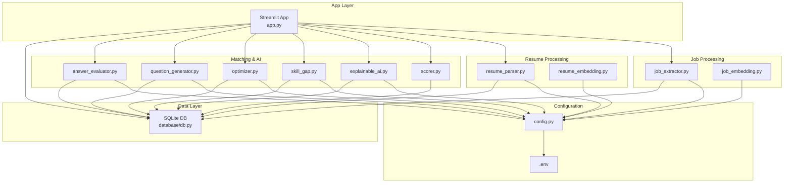
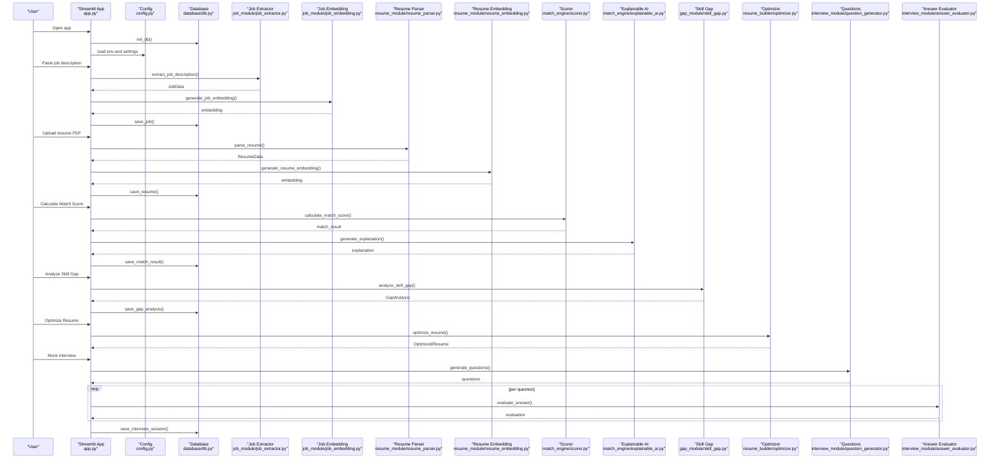
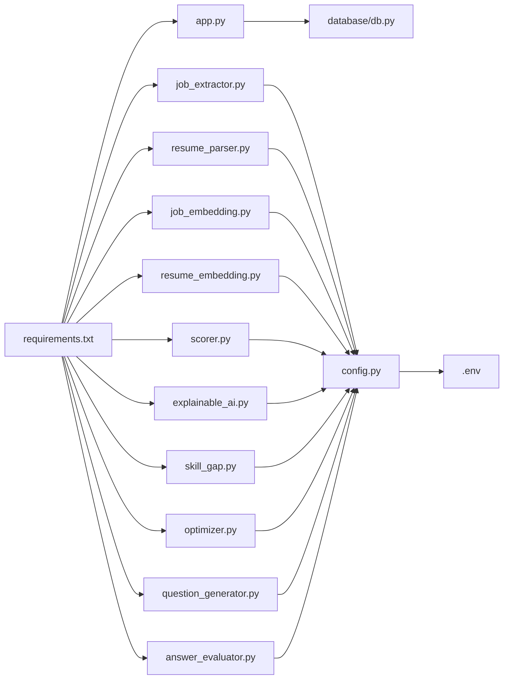
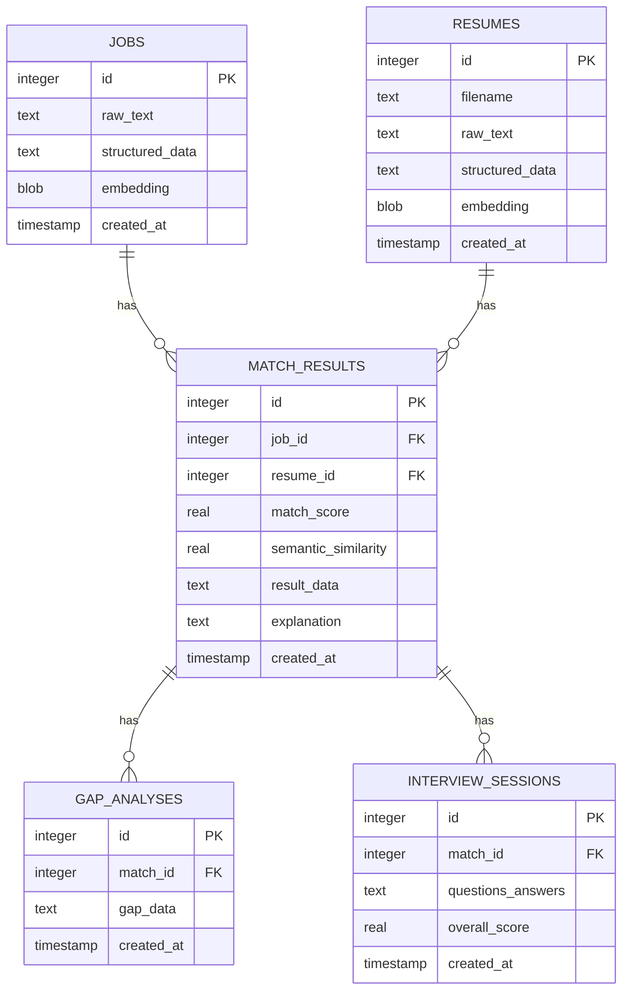

# Getting Started

<cite>
**Referenced Files in This Document**
- [requirements.txt](file://requirements.txt)
- [app.py](file://app.py)
- [config.py](file://config.py)
- [.env](file://.env)
- [database/db.py](file://database/db.py)
- [job_module/job_extractor.py](file://job_module/job_extractor.py)
- [resume_module/resume_parser.py](file://resume_module/resume_parser.py)
- [job_module/job_embedding.py](file://job_module/job_embedding.py)
- [resume_module/resume_embedding.py](file://resume_module/resume_embedding.py)
- [match_engine/scorer.py](file://match_engine/scorer.py)
- [match_engine/explainable_ai.py](file://match_engine/explainable_ai.py)
- [gap_module/skill_gap.py](file://gap_module/skill_gap.py)
- [resume_builder/optimizer.py](file://resume_builder/optimizer.py)
- [interview_module/question_generator.py](file://interview_module/question_generator.py)
- [interview_module/answer_evaluator.py](file://interview_module/answer_evaluator.py)
</cite>

## Table of Contents
1. [Introduction](#introduction)
2. [Project Structure](#project-structure)
3. [Core Components](#core-components)
4. [Architecture Overview](#architecture-overview)
5. [Detailed Component Analysis](#detailed-component-analysis)
6. [Dependency Analysis](#dependency-analysis)
7. [Performance Considerations](#performance-considerations)
8. [Troubleshooting Guide](#troubleshooting-guide)
9. [Conclusion](#conclusion)
10. [Appendices](#appendices)

## Introduction
This guide helps you set up and run the Job Matching Platform locally. It covers prerequisites, environment setup, configuration, initial database initialization, and step-by-step usage of the Streamlit interface. You will learn how to input job descriptions, upload resumes, and interpret results such as match scores, explanations, skill gaps, resume optimization suggestions, and mock interview evaluations.

## Project Structure
The platform is organized into feature-focused packages and a central Streamlit app that orchestrates the entire workflow. Key areas:
- app.py: Streamlit UI and navigation
- config.py: Global settings, API keys, model names, and scoring weights
- .env: Stores the Gemini API key
- database/: SQLite schema and helpers
- job_module/: job extraction, embedding generation
- resume_module/: resume parsing, embedding generation
- match_engine/: scoring, explanations
- gap_module/: skill gap analysis
- resume_builder/: resume optimization suggestions
- interview_module/: question generation, voice engine, answer evaluation



**Diagram sources**
- [app.py](file://app.py#L1-L560)
- [config.py](file://config.py#L1-L23)
- [.env](file://.env#L1-L2)
- [database/db.py](file://database/db.py#L1-L252)
- [job_module/job_extractor.py](file://job_module/job_extractor.py#L1-L82)
- [resume_module/resume_parser.py](file://resume_module/resume_parser.py#L1-L87)
- [job_module/job_embedding.py](file://job_module/job_embedding.py#L1-L37)
- [resume_module/resume_embedding.py](file://resume_module/resume_embedding.py#L1-L37)
- [match_engine/scorer.py](file://match_engine/scorer.py#L1-L152)
- [match_engine/explainable_ai.py](file://match_engine/explainable_ai.py#L1-L76)
- [gap_module/skill_gap.py](file://gap_module/skill_gap.py#L1-L82)
- [resume_builder/optimizer.py](file://resume_builder/optimizer.py#L1-L91)
- [interview_module/question_generator.py](file://interview_module/question_generator.py#L1-L83)
- [interview_module/answer_evaluator.py](file://interview_module/answer_evaluator.py#L1-L117)

**Section sources**
- [app.py](file://app.py#L1-L560)
- [config.py](file://config.py#L1-L23)
- [.env](file://.env#L1-L2)
- [database/db.py](file://database/db.py#L1-L252)

## Core Components
- Streamlit UI: Provides six-step guided workflow from job input to mock interview results.
- Configuration: Centralized settings for Gemini API key/model, embedding model, scoring weights, and retry policy.
- Database: SQLite-backed persistence for jobs, resumes, match results, gap analyses, and interview sessions.
- AI Pipelines:
  - Job extraction: Structured job data from raw text using Gemini.
  - Resume parsing: Structured resume data from PDF text using Gemini.
  - Embeddings: Semantic vectors for jobs and resumes using sentence-transformers.
  - Scoring: Combined similarity and categorical metrics with configurable weights.
  - Explanations: Human-friendly summaries of match outcomes.
  - Gap Analysis: Learning recommendations based on missing skills/tools.
  - Resume Optimization: ATS-aligned suggestions to strengthen resumes.
  - Interview: Adaptive questions and automated evaluation with optional voice.

**Section sources**
- [app.py](file://app.py#L1-L560)
- [config.py](file://config.py#L1-L23)
- [database/db.py](file://database/db.py#L1-L252)
- [job_module/job_extractor.py](file://job_module/job_extractor.py#L1-L82)
- [resume_module/resume_parser.py](file://resume_module/resume_parser.py#L1-L87)
- [job_module/job_embedding.py](file://job_module/job_embedding.py#L1-L37)
- [resume_module/resume_embedding.py](file://resume_module/resume_embedding.py#L1-L37)
- [match_engine/scorer.py](file://match_engine/scorer.py#L1-L152)
- [match_engine/explainable_ai.py](file://match_engine/explainable_ai.py#L1-L76)
- [gap_module/skill_gap.py](file://gap_module/skill_gap.py#L1-L82)
- [resume_builder/optimizer.py](file://resume_builder/optimizer.py#L1-L91)
- [interview_module/question_generator.py](file://interview_module/question_generator.py#L1-L83)
- [interview_module/answer_evaluator.py](file://interview_module/answer_evaluator.py#L1-L117)

## Architecture Overview
The app initializes the database, loads configuration, and exposes a sidebar-driven workflow. Each step triggers module-specific logic and persists results to the database.



**Diagram sources**
- [app.py](file://app.py#L1-L560)
- [config.py](file://config.py#L1-L23)
- [database/db.py](file://database/db.py#L1-L252)
- [job_module/job_extractor.py](file://job_module/job_extractor.py#L1-L82)
- [job_module/job_embedding.py](file://job_module/job_embedding.py#L1-L37)
- [resume_module/resume_parser.py](file://resume_module/resume_parser.py#L1-L87)
- [resume_module/resume_embedding.py](file://resume_module/resume_embedding.py#L1-L37)
- [match_engine/scorer.py](file://match_engine/scorer.py#L1-L152)
- [match_engine/explainable_ai.py](file://match_engine/explainable_ai.py#L1-L76)
- [gap_module/skill_gap.py](file://gap_module/skill_gap.py#L1-L82)
- [resume_builder/optimizer.py](file://resume_builder/optimizer.py#L1-L91)
- [interview_module/question_generator.py](file://interview_module/question_generator.py#L1-L83)
- [interview_module/answer_evaluator.py](file://interview_module/answer_evaluator.py#L1-L117)

## Detailed Component Analysis

### Prerequisites
- Python 3.x: The project uses modern Python features and libraries. Ensure you have a recent Python 3 interpreter installed.
- System dependencies:
  - PyAudio and PortAudio: Required for microphone-based voice features in the interview module.
  - Poppler utilities (optional): Some environments require poppler for PDF text extraction; however, this project uses PyMuPDF, which bundles its own PDF parsing and does not depend on external poppler binaries.
- Hardware requirements:
  - CPU: Multi-core recommended for efficient embedding generation and AI inference.
  - RAM: At least 8 GB recommended; more for larger PDFs and embedding computations.
  - Disk: ~500 MB for local SQLite database plus model caches (~1–2 GB for sentence-transformers and Gemini model metadata).
  - Network: Internet connection for initial model downloads and Gemini API calls.

**Section sources**
- [requirements.txt](file://requirements.txt#L1-L12)
- [resume_module/resume_parser.py](file://resume_module/resume_parser.py#L39-L46)
- [interview_module/answer_evaluator.py](file://interview_module/answer_evaluator.py#L1-L117)

### Installation and Environment Setup
Follow these steps to prepare your environment:

1. Clone or copy the repository to your machine.
2. Create a virtual environment:
   - Linux/macOS:
     - python3 -m venv .venv
     - source .venv/bin/activate
   - Windows:
     - python -m venv .venv
     - .venv\Scripts\activate
3. Upgrade pip:
   - pip install --upgrade pip
4. Install dependencies:
   - pip install -r requirements.txt
5. Prepare the .env file:
   - Copy the provided .env.example (if present) or create .env in the project root.
   - Set GEMINI_API_KEY to your Gemini API key.
6. Initialize the database:
   - Run the app once to trigger database initialization, or execute the initialization function from the database module.
7. Launch the app:
   - streamlit run app.py

Notes:
- The app automatically initializes the SQLite database on startup.
- The first run of embedding or Gemini-dependent modules may download model files; expect slower runtime on first use.

**Section sources**
- [requirements.txt](file://requirements.txt#L1-L12)
- [.env](file://.env#L1-L2)
- [config.py](file://config.py#L1-L23)
- [database/db.py](file://database/db.py#L15-L77)
- [app.py](file://app.py#L25-L26)

### Initial Setup Checklist
- API key configuration:
  - Confirm GEMINI_API_KEY is present in .env.
  - Verify the key is valid and has access to the configured model.
- Database initialization:
  - On first run, the app creates tables for jobs, resumes, match results, gap analyses, and interview sessions.
- First-run verification:
  - Start the app and navigate through the steps to ensure each module runs without errors.

**Section sources**
- [.env](file://.env#L1-L2)
- [config.py](file://config.py#L6-L8)
- [database/db.py](file://database/db.py#L15-L77)
- [app.py](file://app.py#L25-L26)

### Basic Usage Walkthrough
- Open the app in your browser.
- Navigate using the left sidebar:
  1) Job Description: Paste a full job posting and click Extract. Review the extracted fields and embeddings are saved.
  2) Upload Resume: Choose a PDF file and click Parse. View parsed skills, projects, and tools; embeddings are saved.
  3) Match Analysis: Click Calculate Match Score to compute the combined score and generate an explanation. Results are persisted.
  4) Skill Gap: Analyze missing skills/tools and receive recommended courses and project ideas.
  5) Resume Optimizer: Get tailored suggestions to align your resume with the job.
  6) Mock Interview: Generate adaptive interview questions, optionally with voice, record or type answers, and review scores and feedback.

Tips:
- Use realistic job descriptions and clean PDFs for best results.
- The explanation module provides actionable insights to improve your profile.
- Voice features require a working microphone and speaker; ensure permissions are granted.

**Section sources**
- [app.py](file://app.py#L74-L132)
- [app.py](file://app.py#L137-L203)
- [app.py](file://app.py#L208-L308)
- [app.py](file://app.py#L313-L372)
- [app.py](file://app.py#L378-L420)
- [app.py](file://app.py#L424-L560)

## Dependency Analysis
The app depends on several libraries for NLP, embeddings, AI inference, audio, and UI. The dependency graph below reflects module-level imports and runtime relationships.



**Diagram sources**
- [requirements.txt](file://requirements.txt#L1-L12)
- [app.py](file://app.py#L1-L21)
- [job_module/job_extractor.py](file://job_module/job_extractor.py#L1-L10)
- [resume_module/resume_parser.py](file://resume_module/resume_parser.py#L1-L11)
- [job_module/job_embedding.py](file://job_module/job_embedding.py#L1-L5)
- [resume_module/resume_embedding.py](file://resume_module/resume_embedding.py#L1-L5)
- [match_engine/scorer.py](file://match_engine/scorer.py#L1-L6)
- [match_engine/explainable_ai.py](file://match_engine/explainable_ai.py#L1-L7)
- [gap_module/skill_gap.py](file://gap_module/skill_gap.py#L1-L9)
- [resume_builder/optimizer.py](file://resume_builder/optimizer.py#L1-L9)
- [interview_module/question_generator.py](file://interview_module/question_generator.py#L1-L8)
- [interview_module/answer_evaluator.py](file://interview_module/answer_evaluator.py#L1-L11)
- [config.py](file://config.py#L1-L23)
- [.env](file://.env#L1-L2)

**Section sources**
- [requirements.txt](file://requirements.txt#L1-L12)
- [app.py](file://app.py#L1-L21)
- [config.py](file://config.py#L1-L23)

## Performance Considerations
- Model downloads: The first run downloads sentence-transformers and related assets; subsequent runs are faster.
- Embedding computation: Generating embeddings for long texts or many documents can be CPU-intensive; consider batching and caching.
- Gemini API rate limits: Free tier quotas reset periodically; implement retries and monitor quota exhaustion messages.
- SQLite writes: Frequent writes during multi-step workflows are generally fast; avoid extremely large resume uploads to reduce processing time.
- Voice I/O: Audio recording and playback can be slow on low-end devices; disable voice mode if needed.

[No sources needed since this section provides general guidance]

## Troubleshooting Guide
Common issues and resolutions:

- Missing or invalid Gemini API key:
  - Symptom: Errors mentioning quota exceeded or invalid key.
  - Fix: Set a valid GEMINI_API_KEY in .env and restart the app.
  - Reference: [config.py](file://config.py#L6-L8), [.env](file://.env#L1-L2)

- Rate limit/quota exceeded:
  - Symptom: Exceptions indicating resource exhaustion or 429-like errors.
  - Fix: Wait for the quota to reset or upgrade billing at the Gemini console.
  - References:
    - [job_module/job_extractor.py](file://job_module/job_extractor.py#L65-L70)
    - [resume_module/resume_parser.py](file://resume_module/resume_parser.py#L69-L74)
    - [match_engine/explainable_ai.py](file://match_engine/explainable_ai.py#L68-L71)
    - [gap_module/skill_gap.py](file://gap_module/skill_gap.py#L72-L77)
    - [resume_builder/optimizer.py](file://resume_builder/optimizer.py#L82-L86)
    - [interview_module/question_generator.py](file://interview_module/question_generator.py#L73-L78)

- Database initialization failures:
  - Symptom: Errors accessing tables or missing schema.
  - Fix: Ensure the app runs once to initialize tables; verify file permissions for the database directory.
  - Reference: [database/db.py](file://database/db.py#L15-L77)

- PDF parsing issues:
  - Symptom: Empty or garbled resume text.
  - Fix: Use a clean, standard PDF; ensure the file is not password-protected.
  - Reference: [resume_module/resume_parser.py](file://resume_module/resume_parser.py#L39-L46)

- Voice features not working:
  - Symptom: Microphone unavailable or no audio output.
  - Fix: Install PyAudio and ensure system audio/microphone permissions; test with a simple audio app.
  - Reference: [interview_module/answer_evaluator.py](file://interview_module/answer_evaluator.py#L1-L117)

- Slow performance:
  - Symptom: Long delays during embeddings or AI calls.
  - Fix: Close other memory-heavy apps, ensure sufficient RAM, and avoid very large PDFs.
  - References:
    - [job_module/job_embedding.py](file://job_module/job_embedding.py#L16-L37)
    - [resume_module/resume_embedding.py](file://resume_module/resume_embedding.py#L16-L37)

**Section sources**
- [config.py](file://config.py#L6-L8)
- [.env](file://.env#L1-L2)
- [job_module/job_extractor.py](file://job_module/job_extractor.py#L65-L70)
- [resume_module/resume_parser.py](file://resume_module/resume_parser.py#L39-L46)
- [database/db.py](file://database/db.py#L15-L77)
- [interview_module/answer_evaluator.py](file://interview_module/answer_evaluator.py#L1-L117)
- [job_module/job_embedding.py](file://job_module/job_embedding.py#L16-L37)
- [resume_module/resume_embedding.py](file://resume_module/resume_embedding.py#L16-L37)

## Conclusion
You now have the prerequisites, environment setup, and operational knowledge to run the Job Matching Platform locally. Use the guided steps in the Streamlit app to extract job details, parse resumes, compute match scores, analyze skill gaps, optimize your resume, and practice interviews. If you encounter issues, consult the troubleshooting section and verify your configuration and network conditions.

[No sources needed since this section summarizes without analyzing specific files]

## Appendices

### Appendix A: Environment Variables
- GEMINI_API_KEY: Your Gemini API key used by all AI modules.
- GEMINI_MODEL: The model used for extraction, evaluation, and generation tasks.
- EMBEDDING_MODEL: The sentence-transformers model used for semantic embeddings.
- DB_PATH: Path to the SQLite database file.
- SCORING_WEIGHTS: Configurable weights for semantic similarity, skills, experience, education, and tools.
- MAX_RETRIES and RETRY_DELAY: Retry policy for API calls.

**Section sources**
- [.env](file://.env#L1-L2)
- [config.py](file://config.py#L6-L23)

### Appendix B: Database Schema Overview
The database consists of five tables:
- jobs: Raw and structured job data, embeddings, timestamps.
- resumes: Filename, raw text, structured data, embeddings, timestamps.
- match_results: Match score, semantic similarity, detailed result data, explanation, timestamps.
- gap_analyses: Gap analysis data linked to match results.
- interview_sessions: Questions/answers and overall score linked to match results.



**Diagram sources**
- [database/db.py](file://database/db.py#L19-L74)
# Job Application Analysis System - Implementation Plan

## Overview
Build a full-stack Python application that analyzes job descriptions against resumes using Gemini AI, provides semantic matching with explainable scoring, identifies skill gaps, optimizes resumes for ATS, and conducts voice-based adaptive interviews.

## User Preferences
- **API Key:** .env file with python-dotenv
- **STT:** SpeechRecognition
- **TTS:** pyttsx3
- **Gemini Model:** gemini-2.0-flash

## Project Structure
```
d:\JobProject/
├── app.py                          # Streamlit frontend
├── config.py                       # Centralized configuration
├── .env                            # GEMINI_API_KEY (gitignored)
├── .gitignore
├── requirements.txt
├── database/
│   ├── __init__.py
│   └── db.py                       # SQLite CRUD + embedding serialization
├── job_module/
│   ├── __init__.py
│   ├── job_extractor.py            # Gemini extraction + Pydantic validation
│   └── job_embedding.py            # SentenceTransformer embeddings
├── resume_module/
│   ├── __init__.py
│   ├── resume_parser.py            # PyMuPDF PDF extraction + Gemini structuring
│   └── resume_embedding.py         # SentenceTransformer embeddings
├── match_engine/
│   ├── __init__.py
│   ├── scorer.py                   # Weighted multi-dimensional scoring
│   └── explainable_ai.py           # Gemini-generated explanations
├── gap_module/
│   ├── __init__.py
│   └── skill_gap.py                # Gemini gap analysis + recommendations
├── resume_builder/
│   ├── __init__.py
│   └── optimizer.py                # Gemini ATS optimization
└── interview_module/
    ├── __init__.py
    ├── question_generator.py       # Gemini adaptive question generation
    ├── voice_engine.py             # pyttsx3 TTS + SpeechRecognition STT
    └── answer_evaluator.py         # Embedding similarity + Gemini evaluation
```

## Implementation Order (22 files total)

### Step 1: Foundation
| # | File | Purpose |
|---|------|---------|
| 1 | `requirements.txt` | All Python dependencies |
| 2 | `.env` | API key placeholder |
| 3 | `.gitignore` | Exclude .env, __pycache__, .db files |
| 4 | `config.py` | Load env vars, define model names, DB path, scoring weights |

### Step 2: Database Layer
| # | File | Purpose |
|---|------|---------|
| 5 | `database/__init__.py` | Package init |
| 6 | `database/db.py` | SQLite: 5 tables (jobs, resumes, match_results, gap_analyses, interview_sessions), CRUD ops, embedding serialize/deserialize |

**Tables:**
- `jobs`: id, raw_text, structured_data (JSON), embedding (BLOB), created_at
- `resumes`: id, filename, raw_text, structured_data (JSON), embedding (BLOB), created_at
- `match_results`: id, job_id (FK), resume_id (FK), match_score, semantic_similarity, result_data (JSON), explanation, created_at
- `gap_analyses`: id, match_id (FK), gap_data (JSON), created_at
- `interview_sessions`: id, match_id (FK), questions_answers (JSON), overall_score, created_at

### Step 3: Job Processing Module
| # | File | Purpose |
|---|------|---------|
| 7 | `job_module/__init__.py` | Package init |
| 8 | `job_module/job_extractor.py` | Gemini API call with JSON mode, Pydantic JobData model, store in DB |
| 9 | `job_module/job_embedding.py` | SentenceTransformer (all-MiniLM-L6-v2) embedding generation |

**JobData Pydantic model fields:** job_title, company_name, location, experience_required, skills_required[], education_required, tools_required[], soft_skills[], job_type, salary

### Step 4: Resume Processing Module
| # | File | Purpose |
|---|------|---------|
| 10 | `resume_module/__init__.py` | Package init |
| 11 | `resume_module/resume_parser.py` | PyMuPDF text extraction + Gemini structuring + Pydantic validation |
| 12 | `resume_module/resume_embedding.py` | SentenceTransformer embedding for resume text |

**ResumeData Pydantic model fields:** skills[], projects[], experience_years, education, certifications[], tools[]

### Step 5: Match Engine
| # | File | Purpose |
|---|------|---------|
| 13 | `match_engine/__init__.py` | Package init |
| 14 | `match_engine/scorer.py` | Cosine similarity + weighted scoring (semantic 40%, skill 30%, experience 15%, education 10%, tools 5%) |
| 15 | `match_engine/explainable_ai.py` | Gemini-generated human-readable match explanation |

### Step 6: Gap Analysis + Resume Optimizer
| # | File | Purpose |
|---|------|---------|
| 16 | `gap_module/__init__.py` | Package init |
| 17 | `gap_module/skill_gap.py` | Gemini: recommended_courses[], project_suggestions[], skills_to_add[] |
| 18 | `resume_builder/__init__.py` | Package init |
| 19 | `resume_builder/optimizer.py` | Gemini ATS optimization: new_summary, project_bullets, keywords |

### Step 7: Interview Module
| # | File | Purpose |
|---|------|---------|
| 20 | `interview_module/__init__.py` | Package init |
| 21 | `interview_module/question_generator.py` | Gemini adaptive questions based on job + resume |
| 22 | `interview_module/voice_engine.py` | pyttsx3 TTS + SpeechRecognition STT with text fallback |
| 23 | `interview_module/answer_evaluator.py` | Embedding similarity + Gemini scoring (0-10 scales) |

### Step 8: Streamlit Frontend
| # | File | Purpose |
|---|------|---------|
| 24 | `app.py` | Full Streamlit UI with sidebar navigation, step-wise flow, session state |

**UI Pages:**
1. Job Description input + extraction display
2. Resume PDF upload + parsed data display
3. Match score gauge (0-100, color-coded) + breakdown + explanation
4. Skill gap analysis with course/project recommendations
5. Resume optimization suggestions with copy buttons
6. Voice interview with real-time Q&A and scoring

## Key Design Decisions
- **Gemini JSON mode:** Use `response_mime_type="application/json"` for all extraction calls
- **Embedding storage:** `numpy.tobytes()` / `numpy.frombuffer()` for SQLite BLOB storage
- **Model caching:** Singleton pattern for SentenceTransformer model (loaded once)
- **Streamlit caching:** `@st.cache_resource` for models, `@st.cache_data` for DB reads
- **Error handling:** Retry logic with exponential backoff for Gemini API calls
- **Voice fallback:** Text input box when microphone unavailable

## Dependencies (requirements.txt)
```
streamlit
google-generativeai
sentence-transformers
PyMuPDF
pydantic
python-dotenv
pyttsx3
SpeechRecognition
PyAudio
numpy
scikit-learn
```

## Verification Strategy
1. After creating database/db.py - run a quick test to verify tables are created
2. After each module - test with sample data via Python import
3. After app.py - run `streamlit run app.py` and test the full workflow:
   - Paste a sample job description -> verify extraction
   - Upload a sample PDF resume -> verify parsing
   - Check match score display and explanation
   - Review gap analysis and optimization suggestions
   - Test interview flow (text mode at minimum)
